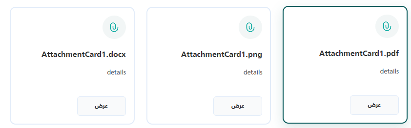

import Tabs from '@theme/Tabs';
import TabItem from '@theme/TabItem';

<Tabs>
<TabItem value="guide" label="Guide" default>
A card for a file attachment showing an icon, the file name, a short description, and a "preview" (عرض) button. The button opens the file through the shared `_FilePreview` modal using a URL built from an action path and the file's ID.

## UI Preview

| State   | Preview                     |
| ------- | --------------------------- |
| Default | |

---

## Location
`Views/Shared/UI/_AttachmentCard.cshtml`

## Usage Examples

### Basic Usage
Pass `FileName` and `FileId`. The component infers the file type from the extension of `FileName` (or of `FileId` when `FileName` is empty).

```html
@await Html.PartialAsync("UI/_AttachmentCard", new {
    FileName = "Contract.pdf",
    Details = "Signed copy of the main contract.",
    FileId = "15243"
})
```

### Advanced Usage
You can optionally provide a fixed `Id` for the DOM element and override the endpoint that returns the file using `ActionUrl`.

```html
@await Html.PartialAsync("UI/_AttachmentCard", new {
    Id = "custom-contract-card",
    FileName = "Project_Requirements.docx",
    Details = "Initial drafted requirements.",
    FileId = "99824",
    ActionUrl = "/CustomController/DownloadAttachment" // Overrides default API
})
```

## Properties

The component accepts an anonymous object with the following properties (names are case-insensitive).

| Property    | Type   | Default Value                    | Description |
| :---------- | :----- | :------------------------------- | :---------- |
| `Id`        | string | Auto-generated (`attachCard-{8 hex chars}`) | The DOM ID of the outer container. |
| `FileName`  | string | Derived from `FileId`           | The title shown in the card, also used to infer the file type. If omitted, the last path segment of `FileId` (without query string) is used. |
| `Details`   | string | `""`                             | The description shown below the file name. |
| `FileId`    | string | `""`                             | The file's ID. The preview URL is always `{ActionUrl}/{FileId}`, so a full URL here is appended to `ActionUrl` rather than used directly. |
| `ActionUrl` | string | `"/Common/PreviewAttachment"`    | The base path of the endpoint that returns the file for the preview. |

## Behavior

- The extension is mapped to `pdf`, `image`, `word`, `excel`, or `other`, and passed to the preview function. The card always shows the same paperclip icon.
- The preview button calls the global `openAttachmentFromUrl(fileId, fileName, fileType)`. It builds `{ActionUrl}/{FileId}` and calls `showFilePreview(url, fileName, fileType)`, or else `window.openPdfViewer(url, fileName)`, or else opens the URL in a new tab. If `FileId` is empty, it shows a status modal with `الملف غير متاح` (file not available).
- The card has no download button.

## Dependencies
This component relies on two other partial views:
1. `UI/_FilePreview`: provides `showFilePreview` and the preview overlay. It is not documented in this repository.
2. `UI/_StatusModal`: provides `showStatusModal`, used when `FileId` is empty.

Both are rendered by every AttachmentCard instance, at the bottom of the partial. The card also uses Bootstrap 5 classes (`btn`, `btn-sm`, `d-flex`, `fw-bold`, `text-muted`, spacing utilities).

## Known Limitations

- `window.openAttachmentFromUrl` is defined only once per page, by whichever component renders first. **AttachBox defines a function with the same name**, so on a page with both components, or with several cards using different `ActionUrl`s, every preview button uses the `ActionUrl` of the first one rendered.
- The `<style>` block is meant to be rendered once, but the check uses the partial's own copy of `ViewData`, which is not shared between partial calls, so it is rendered for every card.

## Accessibility

- The preview button has visible text (`عرض`).
- The file name is always an `<h6>`; check that this fits your page's heading structure.
- The decorative icon has no `aria-hidden` attribute.

## Security Notes

- `FileId` and `FileName` are placed inside a JavaScript string in the preview button's inline `onclick` attribute. Razor's HTML encoding is decoded by the browser before the script runs, so a value containing `'` breaks the handler, and a crafted value can execute script. Only use trusted, sanitized IDs and file names.
- Elsewhere, values use normal Razor encoding.

</TabItem>


<TabItem value="_AttachmentCard.cshtml" label="_AttachmentCard.cshtml">

```cshtml
@using Microsoft.AspNetCore.Routing
@model dynamic
@{
string Id = "";
string FileName = "";
string Details = "";
string FileId = "";
string actionUrl = "/Common/PreviewAttachment";

if (Model != null)
{
    var props = new RouteValueDictionary(Model);
    if (props.TryGetValue("Id", out var idProp)) Id = idProp?.ToString() ?? "";
    if (props.TryGetValue("FileName", out var titleProp)) FileName = titleProp?.ToString() ?? "";
    if (props.TryGetValue("Details", out var dProp)) Details = dProp?.ToString() ?? "";
    if (props.TryGetValue("FileId", out var fProp)) FileId = fProp?.ToString() ?? "";
    if (props.TryGetValue("ActionUrl", out var auProp) && !string.IsNullOrWhiteSpace(auProp?.ToString()))
        actionUrl = auProp.ToString()!;
}

// Display name fallback (used to compute FileName as well)
if (string.IsNullOrWhiteSpace(FileName))
{
    FileName = System.IO.Path.GetFileName(FileId ?? "").Split('?')[0];
}

// Infer type from file extension when FileType is not supplied
string GetExtensionType(string name, string url)
{
    var src = !string.IsNullOrEmpty(name) ? name : url ?? "";
    var ext = System.IO.Path.GetExtension(src).ToLowerInvariant().TrimStart('.');
    return ext switch
    {
        "pdf"                          => "pdf",
        "jpg" or "jpeg" or "png"
            or "gif" or "bmp"
            or "webp" or "svg"         => "image",
        "doc" or "docx"               => "word",
        "xls" or "xlsx" or "csv"      => "excel",
        _                              => "other"
    };
}

string FileType = GetExtensionType(FileName, FileId).ToLowerInvariant();

// Auto-generate a unique id when none is provided
if (string.IsNullOrWhiteSpace(Id))
Id = "attachCard-" + Guid.NewGuid().ToString("N").Substring(0, 8);
}

@if (!Html.ViewData.ContainsKey("AttachmentCardStyleRendered"))
{
Html.ViewData["AttachmentCardStyleRendered"] = true;
<style>
    .attachment-card {
        transition: all 0.3s ease;
        padding: 1rem;
        margin-bottom: 1rem;
        display: flex;
        gap: 1rem;
        flex-direction: column;
        justify-content: space-between;
        margin: 1rem 0;
    }

    .attachment-card:hover {
        transform: translateY(-2px);
        box-shadow: 0 8px 25px rgba(4, 88, 89, 0.15);
        border-color: #045859 !important;
    }

    .attachment-icon {
        display: flex;
        align-items: center;
    }

    .attachment-title {
        font-size: 1rem;
        line-height: 1.4;
    }

    .attachment-preview,
    .attachment-preview:hover,
    .attachment-preview:active,
    .attachment-preview:focus {
        background-color: #F9FAFB;
        border-color: #f9fafb;
        font-weight: bold;
        width: 100px;
        border: 1px solid #E2ECF9;
    }
</style>
}

<div id="@Id" class="attachment-card" style="border: 2px solid #E2ECF9; border-radius: 12px; background: white;">

    <svg xmlns="http://www.w3.org/2000/svg" width="48" height="48" fill="none" viewBox="0 0 48 48">
        <path fill="#045859" fill-opacity=".05"
            d="M0 24C0 10.745 10.745 0 24 0s24 10.745 24 24-10.745 24-24 24S0 37.255 0 24" />
        <path fill="#00a79d" fill-rule="evenodd"
            d="M21.5 15.75A4.25 4.25 0 0 0 17.25 20v5.5a6.75 6.75 0 0 0 13.5 0V24a.75.75 0 0 1 1.5 0v1.5a8.25 8.25 0 0 1-16.5 0V20a5.75 5.75 0 0 1 11.5 0v5.5a3.25 3.25 0 0 1-6.5 0v-4a.75.75 0 0 1 1.5 0v4a1.75 1.75 0 1 0 3.5 0V20a4.25 4.25 0 0 0-4.25-4.25"
            clip-rule="evenodd" />
    </svg>

    <div class="my-2 d-flex flex-column gap-2">
        <h6 class="text-dark fw-bold">@FileName</h6>
        <p class="text-muted small">@Details</p>
    </div>

    <button type="button" class="btn btn-sm attachment-preview"
            data-file-url="@FileId"
            data-file-type="@FileType"
            data-file-name="@FileName"
            onclick="openAttachmentFromUrl('@FileId', '@FileName', '@FileType')">
        عرض
    </button>
</div>

@await Html.PartialAsync("UI/_FilePreview")
@await Html.PartialAsync("UI/_StatusModal")

<script>
    if (typeof window.openAttachmentFromUrl === 'undefined') {
        window.openAttachmentFromUrl = function (id, fileName, fileType) {
            if (!id) {
                 showStatusModal({
                    type: 'info',
                    title: 'الملف غير متاح',
                });
                return;
            }

            let url = `@actionUrl/${ id }`;

            // Use the shared file viewer modal
            if (typeof showFilePreview === 'function') {
                showFilePreview(url, fileName, fileType);
            } else if (window.openPdfViewer) {
                window.openPdfViewer(url, fileName);
            } else {
                // Fallback: open in new tab
                window.open(url, '_blank');
            }
        };
    }
</script>
```

</TabItem>
</Tabs>
