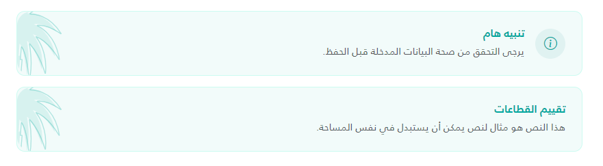

import Tabs from '@theme/Tabs';
import TabItem from '@theme/TabItem';

<Tabs>
<TabItem value="guide" label="Guide" default>
The Banner component is used to display important information or notifications with an optional icon and title in a stylized container.

## UI Preview

| State   | Preview               |
| ------- | --------------------- |
| Default |  |

---

## Usage

To use the banner, include the partial view in your page and pass a C# tuple as the model.

The partial's model type is `(string? Icon, string Title, string Content, string? TitleColor, bool IsSmall)`, so all five elements must be supplied, in this order. Element names are optional; the position determines the meaning. To leave a value empty, pass `""`. A bare `null` inside a tuple literal does not compile when passed as the model; use `(string?)null` if you need an explicit null.

### Basic Example
```cshtml
<partial name="UI/_Banner" model='(Icon: "bi-info-circle", Title: "Notice", Content: "This is a banner message.", TitleColor: "", IsSmall: false)' />
```

### Advanced Example (with Raw HTML Icon)
```cshtml
<partial name="UI/_Banner" model='(
    Icon: "",
    Title: "System Update",
    Content: "The system will undergo maintenance at midnight.",
    TitleColor: "#d9534f",
    IsSmall: true
)' />

or

@await Html.PartialAsync("UI/_Banner", (
    Icon: "",
    Title: "تقييم القطاعات",
    Content: "هذا النص هو مثال لنص يمكن أن يستبدل في نفس المساحة.",
    TitleColor: "#00A79E",
    IsSmall: false
))
```

## Properties

All five tuple elements must be passed. The last column describes what happens when a value is empty.

| Property Name | Type | Description | When empty / `null` |
| :--- | :--- | :--- | :--- |
| `Icon` | `string?` | The icon to display. If the trimmed value starts with `<`, it is rendered as raw HTML (e.g., `` or `&lt;svg>`) and every `~/` in it is replaced with the application base path via `Url.Content`. Otherwise it is rendered as `<i class="bi {Icon}">` (e.g., `bi-gear`). | No icon is rendered. |
| `Title` | `string` | Heading text rendered in an `<h6>` above the content. HTML-encoded. | The title row is not rendered. |
| `Content` | `string` | The body text of the banner. HTML-encoded, so markup is shown as text. | An empty content line is rendered. |
| `TitleColor` | `string?` | CSS color for the title, set through the `--banner-title-color` variable. It does not change the icon color (always `#00A79D`) or the content text (Bootstrap `text-muted`). | `"#1F2937"` |
| `IsSmall` | `bool` | If `true`, adds Bootstrap's `small` class to the content text. | Not nullable; pass `false` for normal size. |

### Raw HTML and Encoding

- A raw HTML `Icon` is output with `Html.Raw` and is **not encoded**. Never pass user-supplied content as `Icon`; it would allow HTML/script injection.
- `TitleColor` is written into an inline `style` attribute. Only pass trusted color values.
- `Title` and `Content` use normal Razor encoding.

## Visual Features
- **Background**: Soft teal background (`#00A79D0D`) with a matching border.
- **Decorative Element**: Includes a palm tree background image (`palm.svg`) positioned on the left side of the banner.
- **Icon Styling**: Icons are wrapped in a 44px circular background (`#E0F2F1`) with icon color `#00A79D`; `` icons are sized to 24px.
- **Layout**: Flex layout that vertically centers the icon and text with a gap. There is no breakpoint-specific behavior.
- **Spacing**: The banner always has Bootstrap's `mb-3` bottom margin.
- **Styles**: The partial outputs its own `<style>` block each time it is rendered. The class names it defines (`.info-banner`, `.palm-bg`, `.banner-icon-wrapper`, `.banner-content-wrapper`, `.info-banner-content`) are global and not scoped to the component.

## Accessibility
- The banner has no ARIA role, so screen readers do not announce it as an alert or status message.
- The title is always an `<h6>`; check that this fits the heading structure of your page.
- The decorative `palm.svg` image has no `alt` attribute.
- Icons are rendered without `aria-hidden` or a text alternative.

## RTL
- The icon and text follow the page's text direction because they use a flex layout.
- The palm decoration is always positioned with `left: 0`, in both LTR and RTL pages.

## Dependencies
- **Bootstrap Icons**: Required for class-based icons (e.g., `bi-info-circle`).
- **Bootstrap 5**: Uses utility classes `mb-3`, `d-flex`, `align-items-center`, `gap-3`, `fw-bold`, `mb-1`, `text-muted`, and `small`.
- **Assets**: requires `~/assets/images/palm.svg` for the background decoration. The path is fixed in the partial and cannot be configured.

</TabItem>


<TabItem value="_Banner.cshtml" label="_Banner.cshtml">

```cshtml
@model (string? Icon, string Title, string Content, string? TitleColor, bool IsSmall)

@{
var titleColor = !string.IsNullOrWhiteSpace(Model.TitleColor) ? Model.TitleColor : "#1F2937";
var contentClass = Model.IsSmall ? "small" : "";
}

<style>
	.info-banner {
		background: #00A79D0D;
		border: 1px solid #CCFBF1;
		border-radius: 12px;
		padding: 1.5rem;
		position: relative;
		overflow: hidden;
		display: flex;
		align-items: center;
		justify-content: space-between;
		color: var(--banner-title-color, #1F2937);
	}

	.info-banner h6 {
		color: var(--banner-title-color, #1F2937) !important;
	}

	.palm-bg {
		position: absolute;
		left: 0;
		height: 100%;
		pointer-events: none;
	}

	.banner-icon-wrapper {
		width: 44px;
		height: 44px;
		background: #E0F2F1;
		border-radius: 50%;
		display: flex;
		align-items: center;
		justify-content: center;
		color: #00A79D;
		font-size: 1.2rem;
		position: relative;
		z-index: 1;
	}

	.banner-icon-wrapper img {
		width: 24px;
		height: 24px;
		object-fit: contain;
	}

	.banner-content-wrapper {
		position: relative;
		z-index: 1;
	}

	.info-banner-content {
		font-weight: 500;
	}
</style>

<div class="info-banner mb-3" style="--banner-title-color: @titleColor;">
	
	<div class="d-flex align-items-center gap-3">
		@if (!string.IsNullOrEmpty(Model.Icon))
		{
		<div class="banner-icon-wrapper">
			@if (Model.Icon.Trim().StartsWith("<")) { var iconHtml=Model.Icon; if (iconHtml.Contains("~/")) {
				iconHtml=iconHtml.Replace("~/", Url.Content("~/")); } @Html.Raw(iconHtml) } else { <i class="bi @Model.Icon">
				</i>
				}
		</div>
		}
		<div class="banner-content-wrapper">
			@if (!string.IsNullOrEmpty(Model.Title))
			{
			<h6 class="fw-bold mb-1">@Model.Title</h6>
			}
			<div class="info-banner-content text-muted @contentClass">@Model.Content</div>
		</div>
	</div>
</div>
```

</TabItem>
</Tabs>
