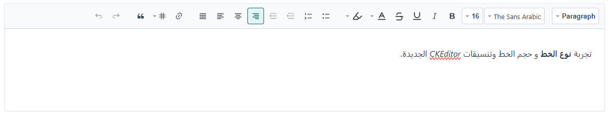

import Tabs from '@theme/Tabs';
import TabItem from '@theme/TabItem';

<Tabs>
<TabItem value="guide" label="Guide" default>
The `_CKEditor.cshtml` partial view wraps the CKEditor 5 Classic build with a custom Word-style toolbar, a custom font formatting plugin, a responsive toolbar layout, one-time asset loading, and required-field validation.

:::note
This guide and its examples use the name `_CKEditor`, while the source tab and the Playground use `_CkEditor.cshtml`. On case-sensitive file systems (for example Linux), the name used in `partial name` / `PartialAsync` must match the actual file name exactly.
:::

## UI Preview

| State   | Preview                    |
| ------- | -------------------------- |
| Default |  |

---

## Basic Usage

Render the partial using an anonymous object or pass the editor ID as a string:

```razor
<!-- Anonymous object model -->
<partial name="UI/_CKEditor"
         model='new { Id = "description", Label = "Description", Required = true }' />

@await Html.PartialAsync("UI/_CKEditor", new {
    id = "editor1",
    label = "وصف الحالة",
    required = true,
    height = "200px"
})

<!-- Direct string ID model -->
<partial name="UI/_CKEditor" model='"quickNotes"' />

<!-- Readonly version -->
@await Html.PartialAsync("UI/_CKEditor", new {
    id = "editor2",
    label = "ملخص القضية (للعرض فقط)",
    value = readonlyContent,
    readOnly = true,
    height = "320px"
})
```

---

## Available Properties

Property names are case-insensitive.

| Property | Type | Default | Description |
| :--- | :--- | :--- | :--- |
| `Id` | `string` | **Required** | Used as the textarea's `id` and `name` and for the editor instance. If it is empty, no editor markup is rendered. |
| `Label` | `string` | `""` | Label text displayed above the editor. Also used in the error message. |
| `Required` | `bool` | `false` | Renders a red asterisk and enables non-empty validation. A `bool` or a string such as `"true"`. |
| `ReadOnly` | `bool` | `false` | Locks the editor in read-only mode and disables the custom toolbar controls. Accepts `readOnly`, `ReadOnly`, or `@readonly`. |
| `Placeholder`| `string` | `Label` value | Placeholder text shown inside the editor when empty. |
| `Height` | `string` | `"160px"` | Editor height (e.g. `"250px"`, `"50vh"`) or `"auto"`. Also used as the minimum height. |
| `Value` | `string` | `""` | Initial HTML content loaded into the editor. |

The editor content is kept in the `<textarea name="{Id}">`, so it is submitted with the form as an HTML string.

---

## Word-Style Toolbar Features

The toolbar is organized into 5 groups. Formatting other than bold/italic, headings, lists, links, tables, and quotes is applied by the custom `SharedFontFormattingPlugin` and stored as inline `style` attributes in the content.

1. **Styles**: Dropdown for `Paragraph`, `Heading 1`, `Heading 2`, and `Heading 3`.
2. **Font & Formatting**:
   - **Font Family**: *The Sans Arabic*, *مهند*, *Arial*, *Tahoma*, *Times New Roman*. The Arabic fonts are only displayed if they are available on the user's device or loaded by your application.
   - **Font Size**: 10px to 72px.
   - **Style Buttons**: Bold, Italic, Underline, Strikethrough. The underline button's tooltip mentions `Ctrl+U`, but the component does not register that keyboard shortcut.
   - **Text Color Control**: 10-column theme color grid, 10 standard colors, and an automatic (black) reset.
   - **Highlight Color Control**: Highlight color grid and a "no color" reset.
3. **Paragraph**:
   - Bulleted list, numbered list, indent, and outdent.
   - Alignment: Right, Center, Left, and Justify.
4. **Insert**:
   - Link, Table (with custom SVG icons), and Blockquote.
5. **History**:
   - Undo and Redo.

The editor is created with `language: 'ar'`, so the content is right-to-left.

---

## Responsive Toolbar Layout

The toolbar adapts across 3 viewport breakpoints:

- **Desktop (≥ 992px)**: Single-line layout.
- **Tablet (768px – 991.98px)**: Two-row layout separating font formatting controls from paragraph and insertion tools.
- **Mobile (&lt; 768px)**: Single-row horizontally scrolling toolbar.

---

## Asset Loading

The CKEditor script (`~/ckeditor5-build-classic/ckeditor.js`), the component styles, and the `CKEditorManager` script are output once per HTTP request, tracked with `Context.Items["CKEditor_Assets_Loaded"]`. Multiple editors on one page share them. Each editor is initialized on `DOMContentLoaded` (or immediately if the page has already loaded).

---

## Advanced JavaScript API

The partial exposes a global `window.CKEditorManager` object.

### 1. Programmatic & Form Validation

The component validates when the editor loses focus and on the `submit` event of the parent form (a capturing listener on `document` that calls `validateAll(form)` and prevents submission if it fails):

```javascript
// Validate all CKEditor instances in a specific form or container
const form = document.getElementById('caseForm');
const isFormValid = window.CKEditorManager.validateAll(form);

// Validate a specific editor element
const specificEditor = document.getElementById('myEditorId');
if (specificEditor.validate) {
    const isValid = specificEditor.validate(true); // Pass true to focus the editor if invalid
}
```

Validation strips HTML tags and `&nbsp;` from the editor data and checks that text remains. When invalid, it adds `.is-invalid` to `.ckeditor-component-wrapper`, which shows `.ckeditor-error-message` (`{Label} مطلوب`). Editors without `Required` are always valid.

:::caution
The hidden source `<textarea>` keeps the native `required` attribute. When a required editor is empty, the browser's own validation stops the submission **before** the `submit` event fires, and it cannot show its message on the hidden field (Chrome logs "An invalid form control ... is not focusable"). In that case the component's error message is only shown after the editor loses focus, or if the form has the `novalidate` attribute.
:::

### 2. Accessing CKEditor Instance

Each `<textarea>` element stores its CKEditor instance once initialization has finished:

```javascript
const editorElement = document.getElementById('myEditorId');
const editorInstance = editorElement.ckeditorInstance;

// Get data
console.log(editorInstance.getData());

// Set data
editorInstance.setData('<p>Updated text</p>');
```

`CKEditorManager.init(id, options)` returns a promise that resolves to the editor (or `null` on failure).

### 3. Data Synchronization & jQuery Validation

The underlying textarea value is updated with the editor data on every change. If jQuery is loaded and the parent form has a jQuery Validation validator, the component calls `$form.validate().element(element)` on each change.

### 4. Backward Compatibility Helpers

Legacy helper functions are mapped to `CKEditorManager`:

```javascript
window.initSharedCKEditor(id, options);
window.validateAllCKEditors(container);
```

---

## Styling & CSS Variables

The editor height is set from the `Height` property: the partial writes `--editor-height` / `--editor-min-height` on the component's own wrapper and sets the height directly on the editable area. Setting these variables on an ancestor element therefore has no effect; use `Height` instead.

The toolbar colors are defined as CSS variables on `:root` and can be overridden:

| Variable | Default | Purpose |
| :--- | :--- | :--- |
| `--editor-toolbar-bg` | `#f8fafc` | Toolbar background color |
| `--editor-toolbar-border` | `#e2e8f0` | Toolbar border color |
| `--editor-toolbar-hover` | `#f1f5f9` | Control hover background |
| `--editor-toolbar-active-bg` | `#e6f4f3` | Active button/swatch background |
| `--editor-toolbar-active-border` | `#026b66` | Active border color |
| `--editor-toolbar-height` | `32px` | Toolbar button/trigger height |
| `--ck-error-color` | `#dc3545` | Validation border and label color |

---

## Dependencies

- **CKEditor 5 Classic build** served at `~/ckeditor5-build-classic/ckeditor.js` (not included). The script uses `editor.enableReadOnlyMode()`, which is available in CKEditor 5 v34 and later. CKEditor 5 is licensed separately (GPL 2.0 or later, or a commercial license).
- **Bootstrap 5 CSS** for the label and textarea classes (`form-label`, `form-control`, `fw-bold`, `text-danger`, spacing utilities).
- **jQuery and jQuery Validation**: optional, only used if present.

## Accessibility

- The editing area and the native CKEditor toolbar buttons use CKEditor's own accessibility support.
- The custom toolbar buttons, dropdowns, and color controls have `aria-label`s, and the dropdowns and color pickers set `aria-haspopup` and `aria-expanded`. Color swatches are labelled with their hex code.
- The `<label>` points to the hidden source textarea, so clicking it does not focus the editor.
- The error message is not linked to the editor with `aria-describedby`.

## Security Notes

- `Value` is HTML and is loaded into the editor, and the submitted value is HTML. CKEditor keeps only content its loaded plugins support. The configuration requests General HTML Support with all elements and attributes allowed; this only takes effect if your CKEditor build includes the General HTML Support plugin. Sanitize the submitted HTML on the server before storing or displaying it.
- `Id`, `Label`, `Placeholder`, and `Height` use normal Razor encoding.

</TabItem>


<TabItem value="_CkEditor.cshtml" label="_CkEditor.cshtml">

```cshtml
@model dynamic
@{
// Global assets check - ensure scripts and styles are loaded only once per page
const string AssetsKey = "CKEditor_Assets_Loaded";
bool assetsLoaded = Context.Items.ContainsKey(AssetsKey);
if (!assetsLoaded) Context.Items[AssetsKey] = true;

// Default values
string id = "";
string label = "";
bool required = false;
bool readOnly = false;
string placeholder = "";
string height = "160px";
string value = "";

// Robust extraction from dynamic model
if (Model != null)
{
if (Model is string modelId)
{
id = modelId;
}
else
{
var properties = Model.GetType().GetProperties();
foreach (var prop in properties)
{
var val = prop.GetValue(Model, null);
if (val == null) continue;

switch (prop.Name.ToLower())
{
case "id": id = val.ToString(); break;
case "label": label = val.ToString(); break;
case "required":
if (val is bool b) required = b;
else if (bool.TryParse(val.ToString(), out bool b2)) required = b2;
break;
case "readonly":
if (val is bool rb) readOnly = rb;
else if (bool.TryParse(val.ToString(), out bool rb2)) readOnly = rb2;
break;
case "height": height = val.ToString(); break;
case "value": value = val.ToString(); break;
case "placeholder": placeholder = val.ToString(); break;
}
}
}
}

if (string.IsNullOrEmpty(placeholder)) placeholder = label;
string editorHeightStyle = height != "auto" ? $"--editor-height: {height};" : "--editor-height: auto;";
}

@if (!assetsLoaded)
{
<script src="~/ckeditor5-build-classic/ckeditor.js"></script>
<style>
	:root {
		--ck-error-color: #dc3545;
		--ck-border-radius: 4px;
		--editor-toolbar-bg: #f8fafc;
		--editor-toolbar-border: #e2e8f0;
		--editor-toolbar-hover: #f1f5f9;
		--editor-toolbar-active-bg: #e6f4f3;
		--editor-toolbar-active-border: #026b66;
		--editor-toolbar-active-color: #026b66;
		--editor-toolbar-height: 32px;
		--editor-toolbar-radius: 4px;
	}

	/* Host Container */
	.ckeditor-component-wrapper .ck-editor {
		width: 100%;
		border-radius: var(--editor-toolbar-radius);
		box-shadow: 0 1px 3px rgba(0, 0, 0, 0.05);
	}

	/* Word-style Unified Toolbar */
	.ckeditor-component-wrapper .ck.ck-toolbar {
		background: var(--editor-toolbar-bg) !important;
		border: 1px solid var(--editor-toolbar-border) !important;
		border-bottom: 1px solid #cbd5e1 !important;
		border-radius: var(--editor-toolbar-radius) var(--editor-toolbar-radius) 0 0 !important;
		padding: 4px 6px !important;
	}

	.ckeditor-component-wrapper .ck-toolbar__items {
		display: flex !important;
		flex-wrap: wrap !important;
		align-items: center !important;
		gap: 3px !important;
		padding: 0 !important;
	}

	/* Toolbar Groups */
	.ckeditor-toolbar-group {
		display: inline-flex;
		align-items: center;
		gap: 2px;
		flex: 0 0 auto;
		white-space: nowrap;
	}

	/* Group Vertical Dividers */
	.ckeditor-toolbar-divider {
		display: inline-block;
		width: 1px;
		height: 20px;
		background-color: #cbd5e1;
		margin: 0 4px;
		flex: 0 0 1px;
		align-self: center;
	}

	/* Responsive Controlled Row Break */
	.ckeditor-toolbar-row-break {
		display: none;
	}

	/* Word-style Button & Control Sizing */
	.ckeditor-component-wrapper .ck.ck-button {
		min-width: var(--editor-toolbar-height);
		height: var(--editor-toolbar-height);
		padding: 0 5px;
		border-radius: var(--editor-toolbar-radius);
		border: 1px solid transparent;
		background: transparent;
		color: #334155;
		font-family: inherit;
		font-size: 13px;
		cursor: pointer;
		transition: background-color 0.15s ease, border-color 0.15s ease, color 0.15s ease;
	}

	.ckeditor-component-wrapper .ck.ck-button:hover:not(.ck-disabled) {
		background-color: var(--editor-toolbar-hover) !important;
		border-color: #cbd5e1 !important;
		color: #0f172a !important;
	}

	.ckeditor-component-wrapper .ck.ck-button.ck-on:not(.ck-disabled) {
		background-color: var(--editor-toolbar-active-bg) !important;
		border-color: var(--editor-toolbar-active-border) !important;
		color: var(--editor-toolbar-active-color) !important;
		font-weight: 600;
	}

	.ckeditor-component-wrapper .ck.ck-button .ck-icon {
		width: 16px;
		height: 16px;
	}

	/* Format buttons text */
	.ckeditor-format-btn {
		font-weight: 700 !important;
		font-size: 14px !important;
	}

	.ckeditor-format-btn--underline span {
		text-decoration: underline;
	}

	.ckeditor-format-btn--strikethrough span {
		text-decoration: line-through;
	}

	/* Custom Dropdowns */
	.ckeditor-dropdown-control {
		position: relative;
		display: inline-block;
		flex: 0 0 auto;
	}

	.ckeditor-dropdown-control__native {
		position: absolute !important;
		width: 1px !important;
		height: 1px !important;
		margin: 0;
		padding: 0;
		clip: rect(0, 0, 0, 0);
		clip-path: inset(50%);
		border: 0;
		overflow: hidden;
		white-space: nowrap;
	}

	.ckeditor-dropdown-control__trigger.ck.ck-button {
		display: inline-flex !important;
		align-items: center !important;
		justify-content: space-between !important;
		width: 100% !important;
		height: var(--editor-toolbar-height) !important;
		border: 1px solid #cbd5e1 !important;
		background: #ffffff !important;
		padding: 0 6px !important;
	}

	.ckeditor-dropdown-control.is-open .ckeditor-dropdown-control__trigger.ck.ck-button {
		background: #ffffff !important;
		border-color: var(--editor-toolbar-active-border) !important;
	}

	.ckeditor-dropdown-control__trigger .ck-button__label,
	.ckeditor-dropdown-control__trigger .ckeditor-dropdown-value {
		display: inline-block !important;
		flex: 1 1 auto;
		min-width: 0;
		overflow: hidden;
		text-align: right;
		text-overflow: ellipsis;
		white-space: nowrap;
		font-size: 12px;
		color: #334155;
		line-height: normal;
	}

	[dir="ltr"] .ckeditor-dropdown-control__trigger .ck-button__label,
	[dir="ltr"] .ckeditor-dropdown-control__trigger .ckeditor-dropdown-value {
		text-align: left;
	}

	/* Unified Dropdown Arrow Styling across all toolbar controls */
	.ckeditor-component-wrapper .ck-dropdown__arrow {
		width: 8px !important;
		height: 8px !important;
		min-width: 8px !important;
		flex: 0 0 8px !important;
		fill: none !important;
		stroke: currentColor !important;
		stroke-width: 1.6 !important;
		stroke-linecap: round !important;
		stroke-linejoin: round !important;
		color: #64748b;
		display: inline-block !important;
		vertical-align: middle !important;
		transition: transform 0.15s ease, color 0.15s ease !important;
	}

	.ckeditor-dropdown-control__trigger .ck-dropdown__arrow {
		margin-inline-start: 4px !important;
	}

	.ckeditor-color-btn .ck-dropdown__arrow {
		margin-inline-start: 2px !important;
	}

	.ckeditor-component-wrapper .ck-dropdown .ck-button.ck-dropdown__button .ck-dropdown__arrow {
		margin-inline-start: 3px !important;
	}

	.ckeditor-component-wrapper .ck.ck-button:hover .ck-dropdown__arrow,
	.ckeditor-component-wrapper .ck.ck-button.ck-on .ck-dropdown__arrow,
	.ckeditor-dropdown-control.is-open .ck-dropdown__arrow,
	.ckeditor-color-control.is-open .ck-dropdown__arrow,
	.ckeditor-component-wrapper .ck-dropdown.ck-open .ck-dropdown__arrow {
		color: #0f172a;
	}

	.ckeditor-dropdown-control.is-open .ck-dropdown__arrow,
	.ckeditor-color-control.is-open .ck-dropdown__arrow,
	.ckeditor-component-wrapper .ck-dropdown.ck-open .ck-dropdown__arrow {
		transform: rotate(180deg) !important;
	}

	/* Native Table Button Refinement */
	.ckeditor-component-wrapper .ck-dropdown .ck-button.ck-dropdown__button {
		display: inline-flex !important;
		align-items: center !important;
		justify-content: center !important;
		height: var(--editor-toolbar-height) !important;
		min-width: 38px !important;
		padding: 0 4px !important;
		border-radius: var(--editor-toolbar-radius) !important;
		border: 1px solid transparent !important;
		background: transparent !important;
		cursor: pointer !important;
		transition: background-color 0.15s ease, border-color 0.15s ease, color 0.15s ease !important;
	}

	.ckeditor-component-wrapper .ck-dropdown .ck-button.ck-dropdown__button:hover:not(.ck-disabled),
	.ckeditor-component-wrapper .ck-dropdown.ck-open .ck-button.ck-dropdown__button {
		background-color: var(--editor-toolbar-hover) !important;
		border-color: #cbd5e1 !important;
		color: #0f172a !important;
	}

	.ckeditor-component-wrapper .ck-dropdown .ck-button.ck-dropdown__button .ck-button__icon {
		width: 16px !important;
		height: 16px !important;
		min-width: 16px !important;
		flex: 0 0 16px !important;
		color: #334155 !important;
		display: inline-flex !important;
		align-items: center !important;
		justify-content: center !important;
	}

	.ckeditor-component-wrapper .ck-dropdown .ck-button.ck-dropdown__button:hover .ck-button__icon {
		color: #0f172a !important;
	}

	/* Dropdown Widths */
	.ckeditor-dropdown--style {
		width: 110px;
	}

	.ckeditor-dropdown--style .ckeditor-dropdown-control__trigger .ck-button__label,
	.ckeditor-dropdown--style .ckeditor-dropdown-control__trigger .ckeditor-dropdown-value {
		font-weight: 600;
	}

	.ckeditor-dropdown--family {
		width: 136px;
	}

	.ckeditor-dropdown--size {
		width: 58px;
	}

	.ckeditor-dropdown--size .ckeditor-dropdown-control__trigger .ck-button__label,
	.ckeditor-dropdown--size .ckeditor-dropdown-control__trigger .ckeditor-dropdown-value {
		text-align: center !important;
		font-weight: 600;
		font-size: 13px;
	}

	/* Floating Popup Menus */
	.ckeditor-dropdown-menu {
		position: fixed;
		display: none;
		max-height: 280px;
		padding: 4px 0;
		overflow-x: hidden;
		overflow-y: auto;
		box-sizing: border-box;
		border: 1px solid #cbd5e1;
		border-radius: 6px;
		background: #ffffff;
		box-shadow: 0 10px 25px -5px rgba(0, 0, 0, 0.12), 0 8px 10px -6px rgba(0, 0, 0, 0.08);
		z-index: 10003;
		user-select: none;
	}

	.ckeditor-dropdown-menu.is-visible {
		display: block;
	}

	.ckeditor-dropdown-menu__option {
		display: flex;
		align-items: center;
		width: 100%;
		min-height: 32px;
		padding: 6px 12px;
		border: 0;
		background: transparent;
		color: #334155;
		font-family: inherit;
		font-size: 13px;
		line-height: 1.4;
		text-align: right;
		white-space: nowrap;
		cursor: pointer;
		transition: background-color 0.1s ease;
	}

	[dir="ltr"] .ckeditor-dropdown-menu__option {
		text-align: left;
	}

	.ckeditor-dropdown-menu__option:hover,
	.ckeditor-dropdown-menu__option:focus-visible {
		outline: 0;
		background: #f1f5f9;
		color: #0f172a;
	}

	.ckeditor-dropdown-menu__option.is-selected {
		background: var(--editor-toolbar-active-bg);
		color: var(--editor-toolbar-active-color);
		font-weight: 600;
	}

	/* Word-style Unified Color Control Button */
	.ckeditor-color-control {
		position: relative;
		display: inline-block;
		flex: 0 0 auto;
	}

	.ckeditor-color-btn.ck.ck-button {
		display: inline-flex;
		align-items: center;
		justify-content: center;
		gap: 3px;
		min-width: 36px;
		height: var(--editor-toolbar-height);
		padding: 0 5px;
		border: 1px solid transparent;
		background: transparent;
		border-radius: var(--editor-toolbar-radius);
		cursor: pointer;
		transition: background-color 0.15s ease, border-color 0.15s ease;
	}

	.ckeditor-color-btn:hover:not(.ck-disabled),
	.ckeditor-color-control.is-open .ckeditor-color-btn {
		background-color: var(--editor-toolbar-hover) !important;
		border-color: #cbd5e1 !important;
	}

	.ckeditor-color-btn__content {
		display: inline-flex;
		flex-direction: column;
		align-items: center;
		justify-content: center;
		line-height: 1;
	}

	.ckeditor-color-btn__icon {
		display: inline-flex;
		align-items: center;
		justify-content: center;
		font-weight: 700;
		font-size: 13px;
		height: 15px;
		color: #334155;
	}

	.ckeditor-color-btn__icon svg {
		width: 15px;
		height: 15px;
	}

	.ckeditor-color-btn__bar {
		display: block;
		width: 16px;
		height: 3px;
		border-radius: 1px;
		margin-top: 1px;
		border: 1px solid rgba(0, 0, 0, 0.15);
		background-color: #000000;
		transition: background-color 0.1s ease;
	}


	/* Word-style Color Popover */
	.ckeditor-color-popover {
		position: fixed;
		display: none;
		width: 232px;
		padding: 8px 10px;
		background: #ffffff;
		border: 1px solid #cbd5e1;
		border-radius: 6px;
		box-shadow: 0 10px 25px -5px rgba(0, 0, 0, 0.15), 0 8px 10px -6px rgba(0, 0, 0, 0.1);
		z-index: 10003;
		direction: rtl;
		box-sizing: border-box;
		user-select: none;
	}

	[dir="ltr"] .ckeditor-color-popover {
		direction: ltr;
	}

	.ckeditor-color-popover.is-visible {
		display: block;
	}

	.ckeditor-palette-header-btn {
		display: flex;
		align-items: center;
		gap: 8px;
		width: 100%;
		padding: 5px 6px;
		border: 1px solid #e2e8f0;
		border-radius: 4px;
		background: #f8fafc;
		color: #334155;
		font-family: inherit;
		font-size: 12px;
		cursor: pointer;
		text-align: right;
		margin-bottom: 6px;
		transition: background-color 0.1s ease, border-color 0.1s ease;
	}

	[dir="ltr"] .ckeditor-palette-header-btn {
		text-align: left;
	}

	.ckeditor-palette-header-btn:hover {
		background: #f1f5f9;
		border-color: #cbd5e1;
	}

	.ckeditor-palette-header-btn .ckeditor-swatch-box {
		width: 14px;
		height: 14px;
		border-radius: 2px;
		border: 1px solid #94a3b8;
		display: inline-block;
		flex-shrink: 0;
	}

	.ckeditor-palette-title {
		font-size: 11px;
		font-weight: 600;
		color: #64748b;
		margin: 6px 0 4px;
		text-align: right;
	}

	[dir="ltr"] .ckeditor-palette-title {
		text-align: left;
	}

	.ckeditor-palette-grid {
		display: grid;
		grid-template-columns: repeat(10, 16px);
		gap: 3px;
		justify-content: space-between;
	}

	.ckeditor-palette-swatch {
		width: 16px;
		height: 16px;
		padding: 0;
		border-radius: 2px;
		border: 1px solid rgba(0, 0, 0, 0.18);
		background-color: var(--swatch-color);
		cursor: pointer;
		position: relative;
		transition: transform 0.1s ease, box-shadow 0.1s ease;
	}

	.ckeditor-palette-swatch:hover,
	.ckeditor-palette-swatch:focus-visible {
		outline: 0;
		transform: scale(1.25);
		z-index: 2;
		box-shadow: 0 0 0 1px #fff, 0 0 0 2px var(--editor-toolbar-active-border);
	}

	.ckeditor-palette-swatch.is-selected {
		box-shadow: 0 0 0 1.5px #fff, 0 0 0 2.5px var(--editor-toolbar-active-border);
		transform: scale(1.15);
		z-index: 1;
	}

	.ckeditor-highlight-grid {
		display: grid;
		grid-template-columns: repeat(5, 34px);
		gap: 4px;
		justify-content: space-between;
	}

	.ckeditor-highlight-swatch {
		width: 34px;
		height: 20px;
		padding: 0;
		border-radius: 2px;
		border: 1px solid rgba(0, 0, 0, 0.18);
		background-color: var(--swatch-color);
		cursor: pointer;
		transition: transform 0.1s ease, box-shadow 0.1s ease;
	}

	.ckeditor-highlight-swatch:hover,
	.ckeditor-highlight-swatch:focus-visible {
		outline: 0;
		transform: scale(1.1);
		z-index: 2;
		box-shadow: 0 0 0 1px #fff, 0 0 0 2px var(--editor-toolbar-active-border);
	}

	.ckeditor-highlight-swatch.is-selected {
		box-shadow: 0 0 0 1.5px #fff, 0 0 0 2.5px var(--editor-toolbar-active-border);
		transform: scale(1.08);
		z-index: 1;
	}

	/* Editable Document Surface */
	.ck-content.ck-editor__editable {
		box-sizing: border-box !important;
		font-family: TheSansArabic, -apple-system, BlinkMacSystemFont, "Segoe UI", Roboto, sans-serif !important;
		font-size: 16px !important;
		color: #1e293b;
		line-height: 1.7;
		padding: 1.25rem 1.5rem !important;
		min-height: var(--editor-min-height, 160px);
		height: var(--editor-height, auto);
		max-height: 600px;
		background: #ffffff !important;
		border: 1px solid var(--editor-toolbar-border) !important;
		border-top: 0 !important;
		border-radius: 0 0 var(--editor-toolbar-radius) var(--editor-toolbar-radius) !important;
		box-shadow: inset 0 1px 2px rgba(0, 0, 0, 0.02);
		overflow-y: auto !important;
	}

	.ck-content.ck-editor__editable:focus,
	.ck-content.ck-editor__editable.ck-focused {
		border-color: var(--editor-toolbar-border) !important;
		box-shadow: inset 0 1px 2px rgba(0, 0, 0, 0.02), 0 0 0 1px var(--editor-toolbar-active-border) !important;
		outline: 0 !important;
	}

	/* Lists */
	.ck-content.ck-editor__editable ul,
	.ck-content.ck-editor__editable ol {
		padding-left: 2rem !important;
		margin: 0.75rem 0;
		list-style-position: outside !important;
	}

	[dir="rtl"] .ck-content.ck-editor__editable ul,
	[dir="rtl"] .ck-content.ck-editor__editable ol {
		padding-right: 2rem !important;
		padding-left: 0 !important;
	}

	/* Tables */
	.ck-content.ck-editor__editable table {
		width: 100%;
		border-collapse: collapse;
		border: 1px solid #cbd5e1;
		margin: 1rem 0;
	}

	.ck-content.ck-editor__editable td,
	.ck-content.ck-editor__editable th {
		padding: 0.6rem 0.8rem;
		border: 1px solid #cbd5e1;
		min-width: 2em;
	}

	/* Validation States */
	.ckeditor-component-wrapper.is-invalid .ck-editor__editable,
	.ckeditor-component-wrapper.is-invalid .ck.ck-toolbar {
		border-color: var(--ck-error-color) !important;
	}

	.ckeditor-component-wrapper.is-invalid .form-label {
		color: var(--ck-error-color) !important;
	}

	.ckeditor-error-message {
		display: none;
		color: var(--ck-error-color);
		font-size: 0.85rem;
		margin-top: 0.25rem;
	}

	.ckeditor-component-wrapper.is-invalid .ckeditor-error-message {
		display: block;
	}

	/* Readonly State */
	.ckeditor-component-wrapper.is-readonly .ck-editor__editable {
		background-color: #f8fafc !important;
		color: #64748b !important;
	}

	.ckeditor-component-wrapper.is-readonly .ck-toolbar {
		pointer-events: none;
		opacity: 0.55;
	}

	/* UI Overlays */
	.ck.ck-balloon-panel {
		z-index: 10001 !important;
	}

	.ck.ck-body_wrapper {
		z-index: 10002 !important;
	}

	/* Medium screens (tablets & narrow desktops: 768px - 991.98px) */
	/* Controlled 2-row layout: Formatting row + Block/tools row */
	@@media (min-width: 768px) and (max-width: 991.98px) {
		.ckeditor-component-wrapper .ck.ck-toolbar {
			overflow-x: auto !important;
			overflow-y: hidden !important;
			scrollbar-width: thin;
			scrollbar-color: #cbd5e1 transparent;
		}

		.ckeditor-component-wrapper .ck-toolbar__items {
			display: flex !important;
			flex-wrap: wrap !important;
			row-gap: 4px !important;
			column-gap: 2px !important;
			align-items: center !important;
		}

		.ckeditor-toolbar-row-break {
			display: block !important;
			flex-basis: 100% !important;
			height: 0 !important;
			margin: 0 !important;
			padding: 0 !important;
			border: 0 !important;
		}

		.ckeditor-toolbar-divider--break {
			display: none !important;
		}

		.ckeditor-dropdown--style {
			width: 100px;
		}

		.ckeditor-dropdown--family {
			width: 120px;
		}

		.ckeditor-dropdown--size {
			width: 52px;
		}

		.ckeditor-toolbar-divider {
			margin: 0 3px;
		}
	}

	/* Small screens / Mobile (phones: max 767.98px) */
	/* OPTION A: Smooth single-row horizontal scrolling toolbar */
	@@media (max-width: 767.98px) {
		.ckeditor-component-wrapper .ck.ck-toolbar {
			overflow-x: auto !important;
			overflow-y: hidden !important;
			-webkit-overflow-scrolling: touch;
			overscroll-behavior-x: contain;
			touch-action: pan-x;
			padding: 4px 6px !important;
			scrollbar-width: thin;
			scrollbar-color: #cbd5e1 transparent;
		}

		.ckeditor-component-wrapper .ck.ck-toolbar::-webkit-scrollbar {
			height: 3px;
		}

		.ckeditor-component-wrapper .ck.ck-toolbar::-webkit-scrollbar-track {
			background: transparent;
		}

		.ckeditor-component-wrapper .ck.ck-toolbar::-webkit-scrollbar-thumb {
			background: #cbd5e1;
			border-radius: 3px;
		}

		.ckeditor-component-wrapper .ck.ck-toolbar::-webkit-scrollbar-thumb:hover {
			background: #94a3b8;
		}

		.ckeditor-component-wrapper .ck-toolbar__items {
			display: flex !important;
			flex-wrap: nowrap !important;
			align-items: center !important;
			width: max-content !important;
			min-width: 100% !important;
			gap: 2px !important;
			padding: 0 2px !important;
		}

		.ckeditor-toolbar-row-break {
			display: none !important;
		}

		.ckeditor-toolbar-divider--break {
			display: inline-block !important;
		}

		.ckeditor-toolbar-group {
			gap: 1px !important;
		}

		.ckeditor-toolbar-divider {
			margin: 0 2px !important;
			height: 18px !important;
			flex: 0 0 1px !important;
		}

		.ckeditor-dropdown--style {
			width: 86px;
		}

		.ckeditor-dropdown--family {
			width: 102px;
		}

		.ckeditor-dropdown--size {
			width: 48px;
		}

		.ckeditor-component-wrapper .ck.ck-button {
			min-width: 30px;
			height: 30px;
			padding: 0 4px;
		}

		.ckeditor-color-btn.ck.ck-button {
			min-width: 32px;
			height: 30px;
			padding: 0 4px;
		}
	}
</style>

<script>
	/**
	 * Adds font attributes & alignment to CKEditor 5 Classic Build.
	 */
	class SharedFontFormattingPlugin {
		constructor(editor) {
			this.editor = editor;
		}

		static get pluginName() {
			return 'SharedFontFormatting';
		}

		init() {
			const editor = this.editor;
			const attributes = [
				'sharedFontFamily',
				'sharedFontSize',
				'sharedFontColor',
				'sharedFontBackgroundColor',
				'sharedUnderline',
				'sharedStrikethrough'
			];

			editor.model.schema.extend('$text', { allowAttributes: attributes });
			editor.model.schema.extend('$block', { allowAttributes: ['sharedTextAlignment'] });

			this.registerAttribute('sharedFontFamily', 'font-family');
			this.registerAttribute('sharedFontSize', 'font-size');
			this.registerAttribute('sharedFontColor', 'color');
			this.registerAttribute('sharedFontBackgroundColor', 'background-color');
			this.registerElementAttribute('sharedUnderline', 'u');
			this.registerElementAttribute('sharedStrikethrough', 's');
			this.registerBlockStyleAttribute('sharedTextAlignment', 'text-align');
		}

		destroy() { }

		registerAttribute(modelAttribute, styleName) {
			const editor = this.editor;
			editor.conversion.for('downcast').attributeToElement({
				model: modelAttribute,
				view: (value, { writer }) => writer.createAttributeElement(
					'span',
					{ style: `${styleName}:${value}` },
					{ priority: 7 }
				)
			});

			editor.conversion.for('upcast').attributeToAttribute({
				view: {
					name: 'span',
					styles: { [styleName]: /.+/ }
				},
				model: {
					key: modelAttribute,
					value: viewElement => viewElement.getStyle(styleName)
				}
			});
		}

		registerElementAttribute(modelAttribute, elementName) {
			const editor = this.editor;
			editor.conversion.for('downcast').attributeToElement({
				model: modelAttribute,
				view: (value, { writer }) => value
					? writer.createAttributeElement(elementName, {}, { priority: 7 })
					: null
			});

			editor.conversion.for('upcast').elementToAttribute({
				view: elementName,
				model: {
					key: modelAttribute,
					value: true
				}
			});
		}

		registerBlockStyleAttribute(modelAttribute, styleName) {
			const editor = this.editor;
			editor.conversion.for('downcast').attributeToAttribute({
				model: modelAttribute,
				view: value => ({ key: 'style', value: { [styleName]: value } })
			});

			editor.conversion.for('upcast').attributeToAttribute({
				view: {
					styles: { [styleName]: /.+/ }
				},
				model: {
					key: modelAttribute,
					value: viewElement => viewElement.getStyle(styleName)
				}
			});
		}
	}

	/**
	 * Core CKEditor Initialization & Word Toolbar Orchestrator
	 */
	window.CKEditorManager = {
		controlIdCounter: 0,

		defaultConfig: {
			removePlugins: ['CKFinderUploadAdapter', 'CKFinder', 'EasyImage', 'Image', 'ImageCaption', 'ImageStyle', 'ImageToolbar', 'ImageUpload', 'MediaEmbed'],
			toolbar: {
				items: [
					'bold', 'italic',
					'bulletedList', 'numberedList', 'outdent', 'indent',
					'link', 'insertTable', 'blockQuote',
					'undo', 'redo'
				],
				shouldNotGroupWhenFull: true
			},
			extraPlugins: [SharedFontFormattingPlugin],
			language: 'ar',
			htmlSupport: { allow: [{ name: /.*/, attributes: true, classes: true, styles: true }] }
		},

		init(elementId, options = {}) {
			const element = typeof elementId === 'string' ? document.getElementById(elementId) : elementId;
			if (!element) return Promise.resolve(null);

			const { readonly, height, ...editorOptions } = options;
			const config = { ...this.defaultConfig, ...editorOptions };

			return ClassicEditor.create(element, config)
				.then(editor => {
					element.ckeditorInstance = editor;
					this.applyCustomStyles(editor, options.height);
					this.organizeWordToolbar(editor);
					this.setupValidation(element, editor);
					this.setupDataSync(element, editor);
					if (readonly === true) {
						editor.enableReadOnlyMode(`ckeditor-component-${element.id}`);
						this.setCustomToolbarReadonly(editor, true);
					}
					return editor;
				})
				.catch(err => {
					console.error('CKEditor Init Error:', err);
					return null;
				});
		},

		applyCustomStyles(editor, height = '160px') {
			const editable = editor.ui.getEditableElement();
			if (!editable) return;

			const isAuto = !height || height === 'auto';
			const minH = isAuto ? 'auto' : height;
			const h = isAuto ? 'auto' : height;

			// 1. CKEditor View Writer: ensures styles live on CKEditor's ViewElement
			// so View-to-DOM synchronization on focus/blur does NOT wipe them
			if (editor.editing && editor.editing.view) {
				editor.editing.view.change(writer => {
					const root = editor.editing.view.document.getRoot();
					if (root) {
						writer.setStyle('box-sizing', 'border-box', root);
						writer.setStyle('min-height', minH, root);
						if (!isAuto) {
							writer.setStyle('height', h, root);
						} else {
							writer.removeStyle('height', root);
						}
					}
				});
			}

			// 2. Direct DOM styling
			editable.style.boxSizing = 'border-box';
			editable.style.minHeight = minH;
			if (!isAuto) {
				editable.style.height = h;
			} else {
				editable.style.height = 'auto';
			}

			// 3. Scoped CSS custom properties on wrapper for cascade stability
			const wrapper = editable.closest('.ckeditor-component-wrapper');
			if (wrapper) {
				wrapper.style.setProperty('--editor-min-height', minH);
				wrapper.style.setProperty('--editor-height', isAuto ? 'auto' : h);
			}
		},

		setCustomToolbarReadonly(editor, isReadonly) {
			const controls = editor._customToolbarControls;
			if (Array.isArray(controls)) {
				controls.forEach(ctrl => {
					if (!ctrl) return;
					if (typeof ctrl.setDisabled === 'function') {
						ctrl.setDisabled(isReadonly);
					} else if (ctrl instanceof HTMLElement) {
						ctrl.disabled = isReadonly;
						ctrl.setAttribute('aria-disabled', isReadonly ? 'true' : 'false');
						ctrl.tabIndex = isReadonly ? -1 : 0;
						ctrl.classList.toggle('ck-disabled', isReadonly);
					}
				});
			}

			const wrapper = editor.ui?.view?.element?.closest('.ckeditor-component-wrapper');
			if (wrapper) wrapper.classList.toggle('is-readonly', isReadonly);
		},

		extractNativeToolbarElements(editor, toolbarContainer) {
			const nativeMap = {};
			const nativeKeys = [
				'bold', 'italic',
				'bulletedList', 'numberedList', 'outdent', 'indent',
				'link', 'insertTable', 'blockQuote',
				'undo', 'redo'
			];

			const keyKeywords = {
				bold: ['عريض', 'غامق', 'bold'],
				italic: ['مائل', 'italic'],
				bulletedList: ['قائمة نقطية', 'نقطية', 'نقط', 'bullet'],
				numberedList: ['قائمة رقمية', 'رقمية', 'رقم', 'numbered', 'number'],
				outdent: ['إنقاص المسافة', 'إنقاص', 'outdent', 'decrease indent'],
				indent: ['زيادة المسافة', 'زيادة', 'indent', 'increase indent'],
				link: ['رابط', 'link', 'unlink'],
				insertTable: ['إدراج جدول', 'جدول', 'table', 'insert table'],
				blockQuote: ['اقتباس', 'quote', 'blockquote'],
				undo: ['تراجع', 'undo'],
				redo: ['إعادة', 'redo']
			};

			const originalElements = toolbarContainer ? Array.from(toolbarContainer.children) : [];
			const usedElements = new Set();

			const testElement = (el, key) => {
				if (!el || !(el instanceof HTMLElement)) return false;
				const texts = [
					el.getAttribute('aria-label'),
					el.getAttribute('data-cke-tooltip-text'),
					el.innerText,
					el.textContent,
					el.title,
					el.className,
					el.querySelector?.('button')?.getAttribute('aria-label'),
					el.querySelector?.('button')?.getAttribute('data-cke-tooltip-text'),
					el.querySelector?.('.ck-button__label')?.textContent
				].filter(Boolean).map(t => String(t).toLowerCase());

				const keywords = keyKeywords[key] || [];
				return keywords.some(kw => texts.some(t => t.includes(kw.toLowerCase())));
			};

			// Phase 1: Semantic matching on original DOM elements
			nativeKeys.forEach(key => {
				for (const el of originalElements) {
					if (!el || usedElements.has(el)) continue;
					if (testElement(el, key)) {
						nativeMap[key] = el;
						usedElements.add(el);
						break;
					}
				}
			});

			// Phase 2: Controlled fallback based on configured toolbar order
			nativeKeys.forEach((key, idx) => {
				if (!nativeMap[key] && originalElements[idx] && !usedElements.has(originalElements[idx])) {
					nativeMap[key] = originalElements[idx];
					usedElements.add(originalElements[idx]);
				}
			});

			// Any remaining unused original elements to preserve
			const unmappedElements = originalElements.filter(el => !usedElements.has(el));

			return { nativeMap, unmappedElements };
		},

		organizeWordToolbar(editor) {
			const toolbarContainer = editor.ui.view.toolbar.element.querySelector('.ck-toolbar__items');
			if (!toolbarContainer) return;

			// Robustly extract native elements BEFORE clearing the container
			const { nativeMap, unmappedElements } = this.extractNativeToolbarElements(editor, toolbarContainer);

			const cleanupCallbacks = [];

			// Helper to create a toolbar group
			const createGroup = (groupName) => {
				const group = document.createElement('div');
				group.className = `ckeditor-toolbar-group ckeditor-toolbar-group--${groupName}`;
				return group;
			};

			const createDivider = () => {
				const divider = document.createElement('div');
				divider.className = 'ckeditor-toolbar-divider';
				divider.setAttribute('aria-hidden', 'true');
				return divider;
			};

			// ==========================================
			// Group 1 — Styles (Paragraph / Headings)
			// ==========================================
			const styleGroup = createGroup('styles');
			const headingCommand = editor.commands.get('heading');
			const styleDropdown = this.createDropdown({
				title: 'النمط',
				type: 'style',
				defaultLabel: 'Paragraph',
				options: [
					{ label: 'Paragraph', value: 'paragraph' },
					{ label: 'Heading 1', value: 'heading1' },
					{ label: 'Heading 2', value: 'heading2' },
					{ label: 'Heading 3', value: 'heading3' }
				],
				onChange: (val) => {
					editor.execute('heading', { value: val });
					editor.editing.view.focus();
				}
			});
			styleGroup.appendChild(styleDropdown.wrapper);
			cleanupCallbacks.push(styleDropdown.destroy);

			// ==========================================
			// Group 2 — Font (Family, Size, B, I, U, S, Color, Highlight)
			// ==========================================
			const fontGroup = createGroup('font');

			// Font Family
			const fontFamilyDropdown = this.createDropdown({
				title: 'نوع الخط',
				type: 'family',
				defaultLabel: 'The Sans Arabic',
				options: [
					{ label: 'The Sans Arabic', value: 'TheSansArabic, sans-serif' },
					{ label: 'مهند', value: "'Mohanad', 'مهند', TheSansArabic, sans-serif" },
					{ label: 'Arial', value: 'Arial, sans-serif' },
					{ label: 'Tahoma', value: 'Tahoma, sans-serif' },
					{ label: 'Times New Roman', value: "'Times New Roman', serif" }
				],
				previewProperty: 'fontFamily',
				onChange: (val) => this.applySelectionAttribute(editor, 'sharedFontFamily', val)
			});
			fontGroup.appendChild(fontFamilyDropdown.wrapper);
			cleanupCallbacks.push(fontFamilyDropdown.destroy);

			// Font Size
			const fontSizeDropdown = this.createDropdown({
				title: 'حجم الخط',
				type: 'size',
				defaultLabel: '16',
				options: ['10', '11', '12', '14', '16', '18', '20', '24', '28', '32', '36', '48', '72']
					.map(val => ({ label: val, value: `${val}px` })),
				onChange: (val) => this.applySelectionAttribute(editor, 'sharedFontSize', val)
			});
			fontGroup.appendChild(fontSizeDropdown.wrapper);
			cleanupCallbacks.push(fontSizeDropdown.destroy);

			// Bold & Italic (Native)
			if (nativeMap.bold) fontGroup.appendChild(nativeMap.bold);
			if (nativeMap.italic) fontGroup.appendChild(nativeMap.italic);

			// Underline (Custom)
			const underlineBtn = this.createButton({
				title: 'تسطير (Ctrl+U)',
				className: 'ckeditor-format-btn ckeditor-format-btn--underline',
				html: '<svg xmlns="http://www.w3.org/2000/svg" width="20" height="20" viewBox="0 0 24 24" fill="none" stroke="currentColor" stroke-width="2" stroke-linecap="round" stroke-linejoin="round" class="lucide lucide-underline preview-icon"><path d="M6 4v6a6 6 0 0 0 12 0V4"/><line x1="4" x2="20" y1="20" y2="20"/></svg>',
				onClick: () => this.toggleSelectionAttribute(editor, 'sharedUnderline')
			});
			fontGroup.appendChild(underlineBtn);

			// Strikethrough (Custom)
			const strikeBtn = this.createButton({
				title: 'يتوسطه خط',
				className: 'ckeditor-format-btn ckeditor-format-btn--strikethrough',
				html: '<span><svg xmlns="http://www.w3.org/2000/svg" width="20" height="20" viewBox="0 0 24 24" fill="none" stroke="currentColor" stroke-width="2" stroke-linecap="round" stroke-linejoin="round" class="lucide lucide-strikethrough preview-icon"><path d="M16 4H9a3 3 0 0 0-2.83 4"/><path d="M14 12a4 4 0 0 1 0 8H6"/><line x1="4" x2="20" y1="12" y2="12"/></svg></span>',
				onClick: () => this.toggleSelectionAttribute(editor, 'sharedStrikethrough')
			});
			fontGroup.appendChild(strikeBtn);

			// Text Color (Word-style visual color control)
			const textColorControl = this.createColorControl({
				type: 'text-color',
				title: 'لون الخط',
				defaultColor: '#000000',
				iconHtml: '<svg xmlns="http://www.w3.org/2000/svg" width="20" height="20" viewBox="0 0 24 24" fill="none" stroke="currentColor" stroke-width="2" stroke-linecap="round" stroke-linejoin="round" class="lucide lucide-baseline preview-icon"><path d="M4 20h16"/><path d="m6 16 6-12 6 12"/><path d="M8 12h8"/></svg>',
				resetLabel: 'تلقائي (أسود)',
				onApply: (color) => this.applySelectionAttribute(editor, 'sharedFontColor', color)
			});
			fontGroup.appendChild(textColorControl.wrapper);
			cleanupCallbacks.push(textColorControl.destroy);

			// Highlight Color (Word-style visual color control)
			const highlightIcon = '<svg xmlns="http://www.w3.org/2000/svg" width="20" height="20" viewBox="0 0 24 24" fill="none" stroke="currentColor" stroke-width="2" stroke-linecap="round" stroke-linejoin="round" class="lucide lucide-highlighter preview-icon"><path d="m9 11-6 6v3h9l3-3"/><path d="m22 12-4.6 4.6a2 2 0 0 1-2.8 0l-5.2-5.2a2 2 0 0 1 0-2.8L14 4"/></svg>';
			const highlightColorControl = this.createColorControl({
				type: 'background-color',
				title: 'لون تمييز النص',
				defaultColor: '#ffff00',
				iconHtml: highlightIcon,
				resetLabel: 'بلا لون',
				onApply: (color) => this.applySelectionAttribute(editor, 'sharedFontBackgroundColor', color)
			});
			fontGroup.appendChild(highlightColorControl.wrapper);
			cleanupCallbacks.push(highlightColorControl.destroy);

			// ==========================================
			// Group 3 — Paragraph (Lists, Indents, Alignment)
			// ==========================================
			const paragraphGroup = createGroup('paragraph');

			if (nativeMap.bulletedList) paragraphGroup.appendChild(nativeMap.bulletedList);
			if (nativeMap.numberedList) paragraphGroup.appendChild(nativeMap.numberedList);
			if (nativeMap.outdent) paragraphGroup.appendChild(nativeMap.outdent);
			if (nativeMap.indent) paragraphGroup.appendChild(nativeMap.indent);

			// Alignment Buttons: Right -> Center -> Left -> Justify
			const alignSvgs = {
				right: '<svg class="ck ck-icon" viewBox="0 0 20 20" fill="none" stroke="currentColor" stroke-width="1.8" stroke-linecap="round"><line x1="3" y1="4.5" x2="17" y2="4.5"/><line x1="7" y1="8.5" x2="17" y2="8.5"/><line x1="3" y1="12.5" x2="17" y2="12.5"/><line x1="9" y1="16.5" x2="17" y2="16.5"/></svg>',
				center: '<svg class="ck ck-icon" viewBox="0 0 20 20" fill="none" stroke="currentColor" stroke-width="1.8" stroke-linecap="round"><line x1="3" y1="4.5" x2="17" y2="4.5"/><line x1="6" y1="8.5" x2="14" y2="8.5"/><line x1="3" y1="12.5" x2="17" y2="12.5"/><line x1="7" y1="16.5" x2="13" y2="16.5"/></svg>',
				left: '<svg class="ck ck-icon" viewBox="0 0 20 20" fill="none" stroke="currentColor" stroke-width="1.8" stroke-linecap="round"><line x1="3" y1="4.5" x2="17" y2="4.5"/><line x1="3" y1="8.5" x2="13" y2="8.5"/><line x1="3" y1="12.5" x2="17" y2="12.5"/><line x1="3" y1="16.5" x2="11" y2="16.5"/></svg>',
				justify: '<svg class="ck ck-icon" viewBox="0 0 20 20" fill="none" stroke="currentColor" stroke-width="1.8" stroke-linecap="round"><line x1="3" y1="4.5" x2="17" y2="4.5"/><line x1="3" y1="8.5" x2="17" y2="8.5"/><line x1="3" y1="12.5" x2="17" y2="12.5"/><line x1="3" y1="16.5" x2="17" y2="16.5"/></svg>'
			};

			const alignButtons = {};
			const alignments = [
				{ key: 'right', title: 'محاذاة لليمين' },
				{ key: 'center', title: 'توسيط' },
				{ key: 'left', title: 'محاذاة لليسار' },
				{ key: 'justify', title: 'ضبط' }
			];

			alignments.forEach(item => {
				const btn = this.createButton({
					title: item.title,
					className: `ckeditor-align-btn ckeditor-align-btn--${item.key}`,
					html: alignSvgs[item.key],
					onClick: () => {
						const current = this.getSelectedBlockAttribute(editor, 'sharedTextAlignment') || '';
						const nextVal = current === item.key ? '' : item.key;
						this.applyBlockAttribute(editor, 'sharedTextAlignment', nextVal);
					}
				});
				alignButtons[item.key] = btn;
				paragraphGroup.appendChild(btn);
			});

			// ==========================================
			// Group 4 — Insert (Link, Table, Quote)
			// ==========================================
			const insertGroup = createGroup('insert');
			if (nativeMap.link) insertGroup.appendChild(nativeMap.link);
			if (nativeMap.insertTable) {
				const tableIcon = nativeMap.insertTable.querySelector('.ck-button__icon');
				if (tableIcon) {
					tableIcon.setAttribute('viewBox', '0 0 24 24');
					tableIcon.innerHTML = '<rect width="18" height="18" x="3" y="3" rx="2" fill="none" stroke="currentColor" stroke-width="1.8" stroke-linecap="round" stroke-linejoin="round"/><path d="M3 9h18M3 15h18M9 3v18M15 3v18" fill="none" stroke="currentColor" stroke-width="1.8" stroke-linecap="round" stroke-linejoin="round"/>';
				}
				const tableArrow = nativeMap.insertTable.querySelector('.ck-dropdown__arrow');
				if (tableArrow) {
					tableArrow.setAttribute('viewBox', '0 0 10 10');
					tableArrow.innerHTML = '<path d="m2.5 3.75 2.5 2.5 2.5-2.5" fill="none" stroke="currentColor" stroke-width="1.6" stroke-linecap="round" stroke-linejoin="round"/>';
				}
				insertGroup.appendChild(nativeMap.insertTable);
			}
			if (nativeMap.blockQuote) insertGroup.appendChild(nativeMap.blockQuote);
			if (Array.isArray(unmappedElements) && unmappedElements.length > 0) {
				unmappedElements.forEach(el => insertGroup.appendChild(el));
			}

			// ==========================================
			// Group 5 — History (Undo, Redo)
			// ==========================================
			const historyGroup = createGroup('history');
			if (nativeMap.undo) historyGroup.appendChild(nativeMap.undo);
			if (nativeMap.redo) historyGroup.appendChild(nativeMap.redo);

			const breakDivider = createDivider();
			breakDivider.classList.add('ckeditor-toolbar-divider--break');

			const rowBreak = document.createElement('div');
			rowBreak.className = 'ckeditor-toolbar-row-break';
			rowBreak.setAttribute('aria-hidden', 'true');

			// Rebuild toolbar container ONLY after all groups are assembled
			toolbarContainer.innerHTML = '';
			toolbarContainer.append(
				styleGroup,
				createDivider(),
				fontGroup,
				breakDivider,
				rowBreak,
				paragraphGroup,
				createDivider(),
				insertGroup,
				createDivider(),
				historyGroup
			);

			const toolbarElement = editor.ui.view.toolbar.element;
			if (toolbarElement && getComputedStyle(toolbarElement).direction === 'rtl') {
				requestAnimationFrame(() => {
					toolbarElement.scrollLeft = 0;
				});
			}

			// Sync active states on selection / attribute change
			const syncToolbarState = () => {
				const selection = editor.model.document.selection;

				// Styles sync (Check heading command or active block element)
				let currentHeading = 'paragraph';
				if (headingCommand && headingCommand.value) {
					currentHeading = headingCommand.value;
				} else {
					const firstBlock = selection.getSelectedBlocks().next().value;
					if (firstBlock) {
						if (firstBlock.name.startsWith('heading')) {
							currentHeading = firstBlock.name;
						} else {
							currentHeading = 'paragraph';
						}
					}
				}
				styleDropdown.setValue(currentHeading);

				// Font Family & Size sync
				fontFamilyDropdown.setValue(selection.getAttribute('sharedFontFamily') || '');
				fontSizeDropdown.setValue(selection.getAttribute('sharedFontSize') || '');

				// Underline & Strike sync
				underlineBtn.classList.toggle('ck-on', selection.hasAttribute('sharedUnderline'));
				underlineBtn.classList.toggle('ck-off', !selection.hasAttribute('sharedUnderline'));
				strikeBtn.classList.toggle('ck-on', selection.hasAttribute('sharedStrikethrough'));
				strikeBtn.classList.toggle('ck-off', !selection.hasAttribute('sharedStrikethrough'));

				// Color bars sync
				const textColor = selection.getAttribute('sharedFontColor');
				textColorControl.updateActiveColor(textColor || '#000000', !!textColor);

				const bgColor = selection.getAttribute('sharedFontBackgroundColor');
				highlightColorControl.updateActiveColor(bgColor || (bgColor ? '#ffff00' : 'transparent'), !!bgColor);

				// Alignment buttons sync
				const currentAlign = this.getSelectedBlockAttribute(editor, 'sharedTextAlignment') || '';
				alignments.forEach(item => {
					const isActive = (currentAlign === item.key) || (!currentAlign && item.key === 'right');
					alignButtons[item.key].classList.toggle('ck-on', isActive);
					alignButtons[item.key].classList.toggle('ck-off', !isActive);
				});
			};

			// Store custom controls for readonly toggling
			editor._customToolbarControls = [
				styleDropdown,
				fontFamilyDropdown,
				fontSizeDropdown,
				underlineBtn,
				strikeBtn,
				textColorControl,
				highlightColorControl,
				...Object.values(alignButtons)
			];

			editor.on('change:isReadOnly', (evt, propertyName, isReadOnly) => {
				this.setCustomToolbarReadonly(editor, isReadOnly);
			});

			editor.model.document.selection.on('change:range', syncToolbarState);
			editor.model.document.selection.on('change:attribute', syncToolbarState);
			editor.model.document.on('change:data', syncToolbarState);
			if (headingCommand) headingCommand.on('change:value', syncToolbarState);

			editor.on('destroy', () => {
				cleanupCallbacks.forEach(cb => { if (typeof cb === 'function') cb(); });
			});

			syncToolbarState();
		},

		createButton(config) {
			const button = document.createElement('button');
			button.type = 'button';
			button.className = `ck ck-button ck-off ${config.className || ''}`;
			button.title = config.title;
			button.setAttribute('aria-label', config.title);
			button.innerHTML = config.html || '';

			button.addEventListener('click', (e) => {
				e.preventDefault();
				if (button.disabled || button.getAttribute('aria-disabled') === 'true') return;
				if (typeof config.onClick === 'function') config.onClick();
			});

			button.setDisabled = (disabled) => {
				button.disabled = disabled;
				button.setAttribute('aria-disabled', disabled ? 'true' : 'false');
				button.tabIndex = disabled ? -1 : 0;
				button.classList.toggle('ck-disabled', disabled);
			};

			return button;
		},

		createDropdown(config) {
			const id = ++this.controlIdCounter;
			const wrapper = document.createElement('div');
			wrapper.className = `ck ck-dropdown ckeditor-dropdown-control ckeditor-dropdown--${config.type}`;
			wrapper.title = config.title;

			const select = document.createElement('select');
			select.className = 'ckeditor-dropdown-control__native';
			select.setAttribute('aria-label', config.title);

			const trigger = document.createElement('button');
			trigger.type = 'button';
			trigger.className = 'ck ck-button ck-off ck-button_with-text ckeditor-dropdown-control__trigger';
			trigger.setAttribute('aria-label', config.title);
			trigger.setAttribute('aria-haspopup', 'listbox');
			trigger.setAttribute('aria-expanded', 'false');

			const labelSpan = document.createElement('span');
			labelSpan.className = 'ck-button__label ckeditor-dropdown-value';
			labelSpan.textContent = config.defaultLabel || config.title;

			const chevron = document.createElementNS('http://www.w3.org/2000/svg', 'svg');
			chevron.classList.add('ck', 'ck-icon', 'ck-dropdown__arrow');
			chevron.setAttribute('viewBox', '0 0 10 10');
			chevron.setAttribute('aria-hidden', 'true');
			chevron.innerHTML = '<path d="m2.5 3.75 2.5 2.5 2.5-2.5" fill="none" stroke="currentColor" stroke-width="1.6" stroke-linecap="round" stroke-linejoin="round"/>';

			trigger.append(labelSpan, chevron);

			const menu = document.createElement('div');
			menu.className = `ckeditor-dropdown-menu ckeditor-dropdown-menu--${config.type}`;
			menu.id = `ckeditor-menu-${config.type}-${id}`;
			menu.setAttribute('role', 'listbox');
			menu.setAttribute('aria-label', config.title);
			trigger.setAttribute('aria-controls', menu.id);

			const optionElements = [];

			config.options.forEach(opt => {
				const optEl = document.createElement('option');
				optEl.value = opt.value;
				optEl.textContent = opt.label;
				select.appendChild(optEl);

				const btn = document.createElement('button');
				btn.type = 'button';
				btn.className = 'ckeditor-dropdown-menu__option';
				btn.dataset.value = opt.value;
				btn.textContent = opt.label;
				btn.tabIndex = -1;
				btn.setAttribute('role', 'option');

				if (opt.value && config.previewProperty) {
					btn.style[config.previewProperty] = opt.value;
				}

				menu.appendChild(btn);
				optionElements.push(btn);
			});

			wrapper.append(select, trigger);

			let viewportListenersAttached = false;

			const positionMenu = () => {
				if (!wrapper.classList.contains('is-open')) return;
				const rect = trigger.getBoundingClientRect();
				menu.style.position = 'fixed';
				const padding = 8;
				const gap = 3;
				const preferredHeight = Math.min(menu.scrollHeight, 260);
				const spaceBelow = window.innerHeight - rect.bottom - padding - gap;
				const spaceAbove = rect.top - padding - gap;
				const openUpward = spaceBelow < preferredHeight && spaceAbove > spaceBelow;

				menu.style.minWidth = `${Math.max(rect.width, 100)}px`;
				menu.style.maxHeight = `${Math.min(260, openUpward ? spaceAbove : spaceBelow)}px`;

				const menuWidth = menu.offsetWidth || 120;
				const isRtl = getComputedStyle(trigger).direction === 'rtl';
				const naturalLeft = isRtl ? rect.right - menuWidth : rect.left;
				const maxLeft = Math.max(padding, window.innerWidth - menuWidth - padding);

				menu.style.left = `${Math.min(Math.max(naturalLeft, padding), maxLeft)}px`;
				menu.style.top = openUpward
					? `${Math.max(padding, rect.top - menu.offsetHeight - gap)}px`
					: `${Math.min(rect.bottom + gap, window.innerHeight - menu.offsetHeight - padding)}px`;
			};

			const close = (restoreFocus = false) => {
				wrapper.classList.remove('is-open');
				trigger.setAttribute('aria-expanded', 'false');
				menu.classList.remove('is-visible');
				menu.remove();
				if (viewportListenersAttached) {
					window.removeEventListener('resize', positionMenu);
					window.removeEventListener('scroll', positionMenu, true);
					viewportListenersAttached = false;
				}
				if (restoreFocus) trigger.focus();
			};

			const open = (focusIndex) => {
				document.body.appendChild(menu);
				wrapper.classList.add('is-open');
				trigger.setAttribute('aria-expanded', 'true');
				menu.classList.add('is-visible');
				if (!viewportListenersAttached) {
					window.addEventListener('resize', positionMenu);
					window.addEventListener('scroll', positionMenu, true);
					viewportListenersAttached = true;
				}
				positionMenu();

				const targetIdx = typeof focusIndex === 'number'
					? focusIndex
					: optionElements.findIndex(el => el.classList.contains('is-selected'));
				optionElements[Math.max(0, targetIdx)]?.focus();
			};

			const choose = (val) => {
				select.value = val;
				setValue(val);
				if (typeof config.onChange === 'function') config.onChange(val);
				close(true);
			};

			const setDisabled = (disabled) => {
				trigger.disabled = disabled;
				trigger.setAttribute('aria-disabled', disabled ? 'true' : 'false');
				trigger.tabIndex = disabled ? -1 : 0;
				trigger.classList.toggle('ck-disabled', disabled);
				select.disabled = disabled;
				if (disabled) close();
			};

			trigger.addEventListener('click', (e) => {
				e.preventDefault();
				if (trigger.disabled || trigger.getAttribute('aria-disabled') === 'true') return;
				if (wrapper.classList.contains('is-open')) close();
				else open();
			});

			trigger.addEventListener('keydown', (e) => {
				if (trigger.disabled || trigger.getAttribute('aria-disabled') === 'true') return;
				if (!['ArrowDown', 'ArrowUp', 'Enter', ' ', 'Escape'].includes(e.key)) return;
				e.preventDefault();
				if (e.key === 'Escape') { close(); return; }
				if (wrapper.classList.contains('is-open')) {
					close();
				} else {
					open(e.key === 'ArrowUp' ? optionElements.length - 1 : 0);
				}
			});

			menu.addEventListener('click', (e) => {
				const optBtn = e.target.closest('.ckeditor-dropdown-menu__option');
				if (optBtn) choose(optBtn.dataset.value);
			});

			menu.addEventListener('keydown', (e) => {
				const currIdx = optionElements.indexOf(document.activeElement);
				if (e.key === 'Escape' || e.key === 'Tab') { close(e.key === 'Escape'); return; }
				if (e.key === 'Enter' || e.key === ' ') {
					e.preventDefault();
					if (currIdx >= 0) choose(optionElements[currIdx].dataset.value);
					return;
				}
				let nextIdx = currIdx;
				if (e.key === 'ArrowDown') nextIdx = Math.min(currIdx + 1, optionElements.length - 1);
				else if (e.key === 'ArrowUp') nextIdx = Math.max(currIdx - 1, 0);
				else if (e.key === 'Home') nextIdx = 0;
				else if (e.key === 'End') nextIdx = optionElements.length - 1;
				else return;

				e.preventDefault();
				optionElements[nextIdx]?.focus();
			});

			const handleOutsideClick = (e) => {
				if (!wrapper.contains(e.target) && !menu.contains(e.target)) close();
			};
			document.addEventListener('click', handleOutsideClick);

			// Normalization helpers for font matching and size matching
			const cleanFont = (f) => (f || '').split(',')[0].replace(/['"]/g, '').trim().toLowerCase();
			const cleanSize = (s) => {
				if (!s) return '';
				const num = parseFloat(s);
				return isNaN(num) ? s : `${num}`;
			};

			const setValue = (val) => {
				select.value = val;

				let matched = null;
				let displayLabel = '';

				if (config.type === 'family') {
					if (val) {
						const targetFont = cleanFont(val);
						matched = config.options.find(opt => opt.value && (
							cleanFont(opt.value) === targetFont ||
							cleanFont(opt.label) === targetFont ||
							opt.label.toLowerCase() === targetFont
						));
					}
					if (matched) {
						displayLabel = matched.label;
					} else if (val) {
						displayLabel = val.split(',')[0].replace(/['"]/g, '').trim();
					} else {
						displayLabel = config.defaultLabel || 'The Sans Arabic';
					}
					labelSpan.textContent = displayLabel;
					if (config.previewProperty) {
						labelSpan.style[config.previewProperty] = val || (matched ? matched.value : 'TheSansArabic, sans-serif');
					}
				} else if (config.type === 'size') {
					const cleanVal = cleanSize(val);
					matched = cleanVal ? config.options.find(opt => cleanSize(opt.value) === cleanVal) : null;
					displayLabel = cleanVal || config.defaultLabel || '16';
					labelSpan.textContent = displayLabel;
				} else {
					// Style / Headings
					matched = config.options.find(opt => opt.value === val);
					displayLabel = matched ? matched.label : (config.defaultLabel || 'Paragraph');
					labelSpan.textContent = displayLabel;
				}

				optionElements.forEach(btn => {
					let isSel = false;
					if (config.type === 'family') {
						if (matched) {
							isSel = btn.dataset.value === matched.value;
						} else if (!val) {
							isSel = cleanFont(btn.dataset.value) === 'thesansarabic' || !btn.dataset.value;
						}
					} else if (config.type === 'size') {
						const currentClean = cleanSize(val) || config.defaultLabel || '16';
						isSel = cleanSize(btn.dataset.value) === currentClean;
					} else {
						const currentStyle = val || 'paragraph';
						isSel = btn.dataset.value === currentStyle;
					}
					btn.classList.toggle('is-selected', isSel);
					btn.setAttribute('aria-selected', isSel ? 'true' : 'false');
				});
			};

			const destroy = () => {
				close();
				document.removeEventListener('click', handleOutsideClick);
			};

			return { wrapper, setValue, destroy, setDisabled };
		},

		createColorControl(config) {
			const id = ++this.controlIdCounter;
			const wrapper = document.createElement('div');
			wrapper.className = `ckeditor-color-control ckeditor-color-control--${config.type}`;

			let currentColor = config.defaultColor || '';

			// Word-style Unified Trigger Button
			const trigger = document.createElement('button');
			trigger.type = 'button';
			trigger.className = `ck ck-button ck-off ckeditor-color-btn ckeditor-color-btn--${config.type}`;
			trigger.title = config.title;
			trigger.setAttribute('aria-label', config.title);
			trigger.setAttribute('aria-haspopup', 'dialog');
			trigger.setAttribute('aria-expanded', 'false');

			const content = document.createElement('span');
			content.className = 'ckeditor-color-btn__content';

			const iconSpan = document.createElement('span');
			iconSpan.className = 'ckeditor-color-btn__icon';
			iconSpan.innerHTML = config.iconHtml;

			const colorBar = document.createElement('span');
			colorBar.className = 'ckeditor-color-btn__bar';
			colorBar.style.backgroundColor = currentColor || (config.type === 'text-color' ? '#000000' : 'transparent');

			content.append(iconSpan, colorBar);

			const chevron = document.createElementNS('http://www.w3.org/2000/svg', 'svg');
			chevron.classList.add('ck', 'ck-icon', 'ck-dropdown__arrow');
			chevron.setAttribute('viewBox', '0 0 10 10');
			chevron.setAttribute('aria-hidden', 'true');
			chevron.innerHTML = '<path d="m2.5 3.75 2.5 2.5 2.5-2.5" fill="none" stroke="currentColor" stroke-width="1.6" stroke-linecap="round" stroke-linejoin="round"/>';

			trigger.append(content, chevron);
			wrapper.appendChild(trigger);

			// Popover
			const popover = document.createElement('div');
			popover.className = 'ckeditor-color-popover';
			popover.id = `ckeditor-color-popover-${id}`;
			popover.setAttribute('role', 'dialog');
			popover.setAttribute('aria-label', config.title);

			// 1. Reset / Automatic Button
			const resetBtn = document.createElement('button');
			resetBtn.type = 'button';
			resetBtn.className = 'ckeditor-palette-header-btn';
			const resetBox = document.createElement('span');
			resetBox.className = 'ckeditor-swatch-box';
			if (config.type === 'text-color') {
				resetBox.style.backgroundColor = '#000000';
			} else {
				resetBox.style.backgroundColor = 'transparent';
				resetBox.style.backgroundImage = 'linear-gradient(45deg, #cbd5e1 25%, transparent 25%, transparent 75%, #cbd5e1 75%), linear-gradient(45deg, #cbd5e1 25%, transparent 25%, transparent 75%, #cbd5e1 75%)';
				resetBox.style.backgroundSize = '8px 8px';
				resetBox.style.backgroundPosition = '0 0, 4px 4px';
			}
			const resetLabelSpan = document.createElement('span');
			resetLabelSpan.textContent = config.resetLabel;
			resetBtn.append(resetBox, resetLabelSpan);
			popover.appendChild(resetBtn);

			const swatchElements = [];

			const createSwatch = (color, isHighlight = false) => {
				const sw = document.createElement('button');
				sw.type = 'button';
				sw.className = isHighlight ? 'ckeditor-highlight-swatch' : 'ckeditor-palette-swatch';
				sw.style.setProperty('--swatch-color', color);
				sw.title = color;
				sw.setAttribute('aria-label', color);
				sw.dataset.color = color;
				swatchElements.push(sw);
				return sw;
			};

			if (config.type === 'text-color') {
				// Theme Colors (Word 10-column palette)
				const themeTitle = document.createElement('div');
				themeTitle.className = 'ckeditor-palette-title';
				themeTitle.textContent = 'ألوان النسق';
				popover.appendChild(themeTitle);

				const themeGrid = document.createElement('div');
				themeGrid.className = 'ckeditor-palette-grid';
				const themeColors = [
					'#ffffff', '#000000', '#eeece1', '#1f497d', '#4f81bd', '#c0504d', '#9bbb59', '#8064a2', '#4bacc6', '#f79646',
					'#f2f2f2', '#7f7f7f', '#ddd9c3', '#c6d9f0', '#dbe5f1', '#f2dcdb', '#ebf1dd', '#e5e0ec', '#dbeef3', '#fdeada',
					'#d8d8d8', '#595959', '#c4bd97', '#8db3e2', '#b8cce4', '#e5b9b7', '#d7e3bc', '#ccc1da', '#b7dde8', '#fbd5b5',
					'#bfbfbf', '#3f3f3f', '#938953', '#548dd4', '#95b3d7', '#d99694', '#c3d69b', '#b2a2c7', '#92cddc', '#fac08f',
					'#a5a5a5', '#262626', '#494429', '#17365d', '#366092', '#953734', '#76933c', '#60497a', '#31859b', '#e36c09',
					'#7f7f7f', '#0c0c0c', '#1d1b10', '#0f243e', '#244062', '#632423', '#4f6128', '#403151', '#205867', '#974806'
				];
				themeColors.forEach(c => themeGrid.appendChild(createSwatch(c, false)));
				popover.appendChild(themeGrid);

				// Standard Colors
				const stdTitle = document.createElement('div');
				stdTitle.className = 'ckeditor-palette-title';
				stdTitle.textContent = 'الألوان القياسية';
				popover.appendChild(stdTitle);

				const stdGrid = document.createElement('div');
				stdGrid.className = 'ckeditor-palette-grid';
				const stdColors = [
					'#c00000', '#ff0000', '#ffc000', '#ffff00', '#92d050',
					'#00b050', '#00b0f0', '#0070c0', '#002060', '#7030a0'
				];
				stdColors.forEach(c => stdGrid.appendChild(createSwatch(c, false)));
				popover.appendChild(stdGrid);
			} else {
				// Highlight Colors (Word 15 Colors)
				const hlTitle = document.createElement('div');
				hlTitle.className = 'ckeditor-palette-title';
				hlTitle.textContent = 'ألوان التمييز';
				popover.appendChild(hlTitle);

				const hlGrid = document.createElement('div');
				hlGrid.className = 'ckeditor-highlight-grid';
				const hlColors = [
					'#ffff00', '#00ff00', '#00ffff', '#ff00ff', '#0000ff',
					'#ff0000', '#000080', '#008080', '#008000', '#800080',
					'#800000', '#808000', '#808080', '#c0c0c0', '#000000'
				];
				hlColors.forEach(c => hlGrid.appendChild(createSwatch(c, true)));
				popover.appendChild(hlGrid);
			}

			let viewportListenersAttached = false;

			const positionPopover = () => {
				if (!wrapper.classList.contains('is-open')) return;
				const rect = trigger.getBoundingClientRect();
				popover.style.position = 'fixed';
				const padding = 8;
				const gap = 3;
				const popHeight = popover.offsetHeight || 260;
				const spaceBelow = window.innerHeight - rect.bottom - padding - gap;
				const spaceAbove = rect.top - padding - gap;
				const openUpward = spaceBelow < popHeight && spaceAbove > spaceBelow;

				const popWidth = popover.offsetWidth || 232;
				const isRtl = getComputedStyle(trigger).direction === 'rtl';
				const naturalLeft = isRtl ? rect.right - popWidth : rect.left;
				const maxLeft = Math.max(padding, window.innerWidth - popWidth - padding);

				popover.style.left = `${Math.min(Math.max(naturalLeft, padding), maxLeft)}px`;
				popover.style.top = openUpward
					? `${Math.max(padding, rect.top - popHeight - gap)}px`
					: `${Math.min(rect.bottom + gap, window.innerHeight - popHeight - padding)}px`;
			};

			const close = (restoreFocus = false) => {
				wrapper.classList.remove('is-open');
				trigger.setAttribute('aria-expanded', 'false');
				popover.classList.remove('is-visible');
				popover.remove();
				if (viewportListenersAttached) {
					window.removeEventListener('resize', positionPopover);
					window.removeEventListener('scroll', positionPopover, true);
					viewportListenersAttached = false;
				}
				if (restoreFocus) trigger.focus();
			};

			const open = () => {
				document.body.appendChild(popover);
				wrapper.classList.add('is-open');
				trigger.setAttribute('aria-expanded', 'true');
				popover.classList.add('is-visible');
				if (!viewportListenersAttached) {
					window.addEventListener('resize', positionPopover);
					window.addEventListener('scroll', positionPopover, true);
					viewportListenersAttached = true;
				}
				positionPopover();

				const selSwatch = swatchElements.find(el => el.classList.contains('is-selected'));
				if (selSwatch) selSwatch.focus();
				else resetBtn.focus();
			};

			const choose = (color) => {
				currentColor = color;
				updateActiveColor(color, !!color);
				if (typeof config.onApply === 'function') config.onApply(color);
				close(true);
			};

			const setDisabled = (disabled) => {
				trigger.disabled = disabled;
				trigger.setAttribute('aria-disabled', disabled ? 'true' : 'false');
				trigger.tabIndex = disabled ? -1 : 0;
				trigger.classList.toggle('ck-disabled', disabled);
				if (disabled) close();
			};

			trigger.addEventListener('click', (e) => {
				e.preventDefault();
				if (trigger.disabled || trigger.getAttribute('aria-disabled') === 'true') return;
				if (wrapper.classList.contains('is-open')) close();
				else open();
			});

			trigger.addEventListener('keydown', (e) => {
				if (trigger.disabled || trigger.getAttribute('aria-disabled') === 'true') return;
				if (!['ArrowDown', 'ArrowUp', 'Enter', ' ', 'Escape'].includes(e.key)) return;
				e.preventDefault();
				if (e.key === 'Escape') { close(); return; }
				if (wrapper.classList.contains('is-open')) {
					close();
				} else {
					open();
				}
			});

			resetBtn.addEventListener('click', (e) => {
				e.preventDefault();
				choose('');
			});

			popover.addEventListener('click', (e) => {
				const sw = e.target.closest('[data-color]');
				if (sw) choose(sw.dataset.color);
			});

			popover.addEventListener('keydown', (e) => {
				if (e.key === 'Escape') { close(true); return; }
				const currIdx = swatchElements.indexOf(document.activeElement);
				if (currIdx === -1) return;

				const cols = config.type === 'text-color' ? 10 : 5;
				let nextIdx = currIdx;
				if (e.key === 'ArrowRight') nextIdx = Math.max(0, currIdx - 1);
				else if (e.key === 'ArrowLeft') nextIdx = Math.min(swatchElements.length - 1, currIdx + 1);
				else if (e.key === 'ArrowDown') nextIdx = Math.min(swatchElements.length - 1, currIdx + cols);
				else if (e.key === 'ArrowUp') nextIdx = Math.max(0, currIdx - cols);
				else if (e.key === 'Enter' || e.key === ' ') {
					e.preventDefault();
					choose(swatchElements[currIdx].dataset.color);
					return;
				} else return;

				e.preventDefault();
				swatchElements[nextIdx]?.focus();
			});

			const handleOutsideClick = (e) => {
				if (!wrapper.contains(e.target) && !popover.contains(e.target)) close();
			};
			document.addEventListener('click', handleOutsideClick);

			const updateActiveColor = (color, isExplicit = false) => {
				currentColor = color;
				if (isExplicit && color) {
					colorBar.style.backgroundColor = color;
				} else {
					colorBar.style.backgroundColor = config.type === 'text-color' ? '#000000' : 'transparent';
				}

				swatchElements.forEach(sw => {
					const isSel = isExplicit && sw.dataset.color && sw.dataset.color.toLowerCase() === (color || '').toLowerCase();
					sw.classList.toggle('is-selected', isSel);
					sw.setAttribute('aria-selected', isSel ? 'true' : 'false');
				});
			};

			const destroy = () => {
				close();
				document.removeEventListener('click', handleOutsideClick);
			};

			return { wrapper, updateActiveColor, destroy };
		},

		applySelectionAttribute(editor, attribute, value) {
			editor.model.change(writer => {
				const selection = editor.model.document.selection;
				if (selection.isCollapsed) {
					if (value) writer.setSelectionAttribute(attribute, value);
					else writer.removeSelectionAttribute(attribute);
					return;
				}
				for (const range of selection.getRanges()) {
					if (value) writer.setAttribute(attribute, value, range);
					else writer.removeAttribute(attribute, range);
				}
			});
			editor.editing.view.focus();
		},

		toggleSelectionAttribute(editor, attribute) {
			const selection = editor.model.document.selection;
			this.applySelectionAttribute(editor, attribute, selection.hasAttribute(attribute) ? '' : true);
		},

		applyBlockAttribute(editor, attribute, value) {
			editor.model.change(writer => {
				for (const block of editor.model.document.selection.getSelectedBlocks()) {
					if (value) writer.setAttribute(attribute, value, block);
					else writer.removeAttribute(attribute, block);
				}
			});
			editor.editing.view.focus();
		},

		getSelectedBlockAttribute(editor, attribute) {
			const firstBlock = editor.model.document.selection.getSelectedBlocks().next().value;
			return firstBlock?.getAttribute(attribute) || '';
		},

		setupValidation(element, editor) {
			element.validate = (focus = false) => {
				if (!element.hasAttribute('required')) return true;

				const content = editor.getData().replace(/<[^>]*>/g, '').replace(/&nbsp;/g, ' ').trim();
				const isValid = content.length > 0;

				const wrapper = element.closest('.ckeditor-component-wrapper');
				if (wrapper) wrapper.classList.toggle('is-invalid', !isValid);

				if (!isValid && focus) editor.editing.view.focus();
				return isValid;
			};

			editor.ui.focusTracker.on('change:isFocused', (evt, name, isFocused) => {
				if (!isFocused) element.validate();
			});
		},

		setupDataSync(element, editor) {
			editor.model.document.on('change:data', () => {
				element.value = editor.getData();

				const wrapper = element.closest('.ckeditor-component-wrapper');
				if (wrapper && wrapper.classList.contains('is-invalid')) element.validate();

				if (window.jQuery) {
					const $el = jQuery(element);
					const $form = $el.closest('form');
					if ($form.data('validator')) $form.validate().element(element);
				}
			});
		},

		validateAll(container = document) {
			const editors = container.querySelectorAll('.ckeditor-component-wrapper textarea');
			let firstInvalid = null;

			editors.forEach(el => {
				if (typeof el.validate === 'function' && !el.validate()) {
					if (!firstInvalid) firstInvalid = el;
				}
			});

			if (firstInvalid) firstInvalid.validate(true);
			return !firstInvalid;
		}
	};

	// Legacy support helpers
	window.initSharedCKEditor = (id, options) => window.CKEditorManager && window.CKEditorManager.init(id, options);
	window.validateAllCKEditors = (container) => window.CKEditorManager && window.CKEditorManager.validateAll(container);

	// Validate only CKEditor instances belonging to the submitted form.
	document.addEventListener('submit', (e) => {
		const form = e.target;
		if (!form?.matches('form') || !form.querySelector('.ckeditor-component-wrapper')) return;
		if (window.CKEditorManager && typeof window.CKEditorManager.validateAll === 'function') {
			if (!window.CKEditorManager.validateAll(form)) e.preventDefault();
		}
	}, true);
</script>
}

@if (!string.IsNullOrEmpty(id))
{
<div class="mb-4 ckeditor-component-wrapper" data-editor-id="@id"
	style="--editor-min-height: @height; @editorHeightStyle">
	@if (!string.IsNullOrEmpty(label))
	{
	<label class="form-label fw-bold text-dark mb-2" for="@id">
		@if (required) { <span class="text-danger me-1">*</span> }
		@label
	</label>
	}

	<textarea id="@id" name="@id" class="form-control" placeholder="@placeholder" @(required ? "required" : ""
		)>@value</textarea>

	<div class="ckeditor-error-message" id="@id-error">@label مطلوب</div>

	<script>
		(function () {
			const init = () => {
				if (window.CKEditorManager) {
					window.CKEditorManager.init('@id', { height: '@height', readonly: @(readOnly ? "true" : "false") });
				}
			};
			if (document.readyState === 'loading') {
				document.addEventListener('DOMContentLoaded', init);
			} else {
				init();
			}
		})();
	</script>
</div>
}
```

</TabItem>
</Tabs>
