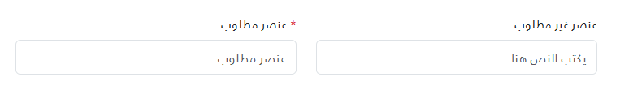
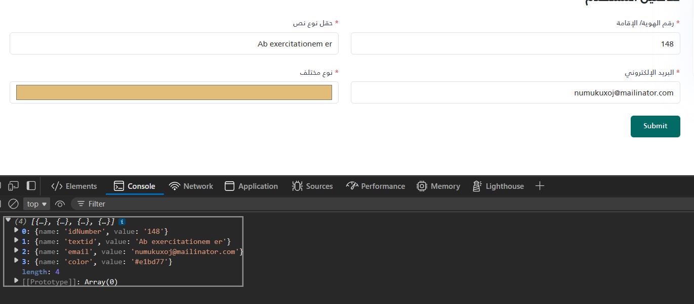

import Tabs from '@theme/Tabs';
import TabItem from '@theme/TabItem';

<Tabs>
<TabItem value="guide" label="Guide" default>
The `_InputField.cshtml` partial view renders a Bootstrap `form-control` input with a label. It takes a tuple model and an optional initial value through `ViewData`. The full source is in the `_InputField.cshtml` tab.

## UI Preview

| State        | Preview                           |
| ------------ | --------------------------------- |
| Single Input |    |
| Group Inputs |   |

---

## Location

`Views/Shared/UI/_InputField.cshtml`

### How to use

```cshtml
<partial name="UI/_InputField" model='("اسم الحقل الاختياري", false, "field-id2", "")' />
<partial name="UI/_InputField" model='("رقم الهوية/ الإقامة", true, "idNumber", " رقم الهوية/ الإقامة", "number")' />
<partial name="UI/_InputField" model='("حقل نوع نص", true, "textid", " نص تجريبي")' />
<partial name="UI/_InputField" model='("البريد الإلكتروني", true, "email", " البريد الإلكتروني", "email")' />

@* No value *@
<partial name="UI/_InputField" model='("حقل نوع نص", true, "textid", " نص تجريبي")' />

@* With value *@
<partial name="UI/_InputField" model='("حقل نوع نص", true, "textid2", " نص تجريبي")'
	view-data='new ViewDataDictionary(ViewData) { { "Value", "القيمة الافتراضية" } }' />

@* With type + value *@
<partial name="UI/_InputField" model='("حقل نوع ايميل", true, "emailid", " email address", "email")'
        view-data='new ViewDataDictionary(ViewData) { { "Value", "mail@domain.com" } }' />
```

## Parameters

The model is declared as `ITuple`, so it must be a tuple with at least 4 elements. Elements are read by position.

| Index | Parameter | Type | Description | Default Value |
| --- | --- | --- | --- | --- |
| `[0]` | Label | `string` | The label text. `null` renders an empty label. | - |
| `[1]` | Required | `bool` | Adds a red asterisk and the native `required` attribute. Must be a `bool`. | - |
| `[2]` | Id | `string` | Used as the input's `id` and `name`. | - |
| `[3]` | Placeholder | `string` | Placeholder text. `null` or empty uses the default. | `"يكتب النص هنا"` |
| `[4]` | Type | `string` | The input's `type` attribute (e.g. `"text"`, `"number"`, `"email"`). Optional; `null` or empty uses the default. | `"text"` |

### Initial Value

The input's `value` is read from `ViewData["Value"]` (as a string); otherwise it is empty. Pass it with the `view-data` attribute as shown above. Because partial views receive a copy of the parent view's `ViewData`, a `"Value"` entry set in the parent view also applies to every `_InputField` rendered without its own `view-data`.

## Behavior

- Required validation is the browser's native `required` validation; the partial has no JavaScript.
- Label, placeholder, id, type, and value are output with normal Razor encoding.
- The label is associated with the input (`for="{Id}"`). No ARIA attributes are added.

## Global Styles

Every time it is rendered, the partial outputs a `<style>` block with **unscoped** rules that apply to all `input` elements on the page, not only this component:

- `direction: rtl; text-align: right;` — every input on the page is right-to-left and right-aligned.
- `appearance: textfield` and hidden WebKit spin buttons — number inputs have no spinner arrows.

## Dependencies

- Bootstrap 5 CSS (`form-label`, `form-control`, `text-danger`, `mb-4`)
- The label also uses a `text-gray-700` class, which is not part of Bootstrap 5; it has no effect unless your application defines it.

</TabItem>


<TabItem value="_InputField.cshtml" label="_InputField.cshtml">

```cshtml
@using System.Runtime.CompilerServices
@model ITuple
@{
var label = (string)Model[0];
var required = (bool)Model[1];
var id = (string)Model[2];
var rawPlaceholder = (string)Model[3];
var placeholder = string.IsNullOrEmpty(rawPlaceholder) ? "يكتب النص هنا" : rawPlaceholder;
// Safely handle optional 5th parameter for Type
var type = (Model.Length > 4 && Model[4] != null) ? (string)Model[4] : "text";
if (string.IsNullOrEmpty(type))
{
type = "text";
}
// Optional value passed via view-data: new ViewDataDictionary(ViewData) { { "Value", "..." } }
var value = ViewData["Value"] as string ?? "";
}
<style>
	input[type=number]::-webkit-outer-spin-button,
	input[type=number]::-webkit-inner-spin-button {
		-webkit-appearance: none;
		margin: 0;
	}

	input {
		-moz-appearance: textfield;
		appearance: textfield;
		direction: rtl;
		text-align: right;
	}
</style>
<div class="mb-4">
	<label class="form-label text-gray-700" for="@id">
		@if (required)
		{
		<span class="text-danger">*</span>
		}
		@label
	</label>
	<input type="@type" id="@id" name="@id" class="form-control" placeholder="@placeholder" value="@value" @(required ? "required" : ""
		) />
</div>

```

</TabItem>
</Tabs>
