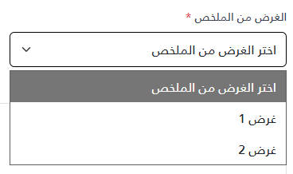

import Tabs from '@theme/Tabs';
import TabItem from '@theme/TabItem';

<Tabs>
<TabItem value="guide" label="Guide" default>
The `_SelectInput.cshtml` partial view renders a native Bootstrap `form-select` dropdown with a label and an empty first option. The full source is in the `_SelectInput.cshtml` tab.

## UI Preview

| State   | Preview                 |
| ------- | ----------------------- |
| Default |  |

---

## Location

`Views/Shared/UI/_SelectInput.cshtml`

### How to use

```cshtml
@{
	var selectFieldOptions = new List<(string Value, string Text)>
	{
		("1", "غرض 1"),
		("2", "غرض 2"),
		("3", "غرض 3"),
	};
}

<partial name="UI/_SelectInput" model='("عنصر مطلوب", true, "my-custom-id-1", "عنصر مطلوب", selectFieldOptions)' />
<partial name="UI/_SelectInput" model='("عنصر غير مطلوب", false, "my-custom-id-2", "عنصر غير مطلوب", selectFieldOptions)' />
```

## Parameters

The model type is the tuple `(string Label, bool Required, string Id, string DefaultOptionText, List<(string Value, string Text)> Options)`. All five elements must be passed, in this order, with these exact types. For example, an array of options instead of a `List` does not match the model type and the partial fails to render.

| Parameter | Type | Description |
| --- | --- | --- |
| Label | `string` | The label text. The `<label>` is always rendered; when the label is empty or whitespace, the wrapper gets a `mt-3` top margin instead. |
| Required | `bool` | Adds a red asterisk and the native `required` attribute. |
| Id | `string` | Used as the select's `id` and `name`. |
| DefaultOptionText | `string` | Text of the first option, which has an empty value (`value=""`). |
| Options | `List<(string Value, string Text)>` | The options. `null` renders only the default option. |

## Behavior

- The select is a native `<select>`; there is no search, option grouping, or JavaScript.
- Required validation uses the browser's native `required` validation. Because the default option's value is empty, submitting without choosing an option fails validation.
- There is no parameter for a pre-selected value; the default option is initially selected.
- The label is associated with the select (`for="{Id}"`). No ARIA attributes are added.
- All values are output with normal Razor encoding.

## Dependencies

- Bootstrap 5 CSS (`form-label`, `form-select`, `text-danger`, `mt-3`)
- The label also uses a `text-gray-700` class, which is not part of Bootstrap 5; it has no effect unless your application defines it.

</TabItem>


<TabItem value="_SelectInput.cshtml" label="_SelectInput.cshtml">

```cshtml
@model (string Label, bool Required, string Id, string DefaultOptionText, List<(string Value, string Text)> Options)

	<div class="@(string.IsNullOrWhiteSpace(Model.Label) ? "mt-3" : "")">
		<label class="form-label text-gray-700" for="@Model.Id">
			@if (Model.Required)
			{
			<span class="text-danger">*</span>
			}
			@Model.Label
		</label>
		<select class="form-select" name="@Model.Id" id="@Model.Id" @(Model.Required ? "required" : "" )>
			<option value="">@Model.DefaultOptionText</option>
			@if (Model.Options != null)
			{
			foreach (var option in Model.Options)
			{
			<option value="@option.Value">@option.Text</option>
			}
			}
		</select>
	</div>
```

</TabItem>
</Tabs>
