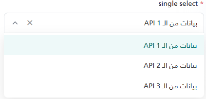
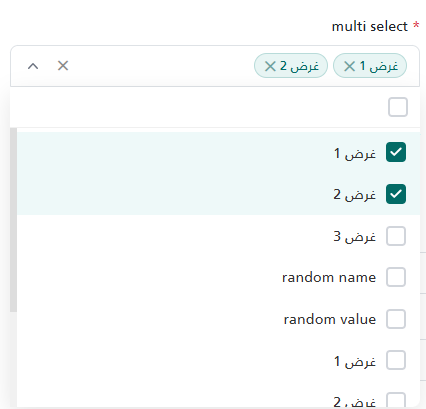
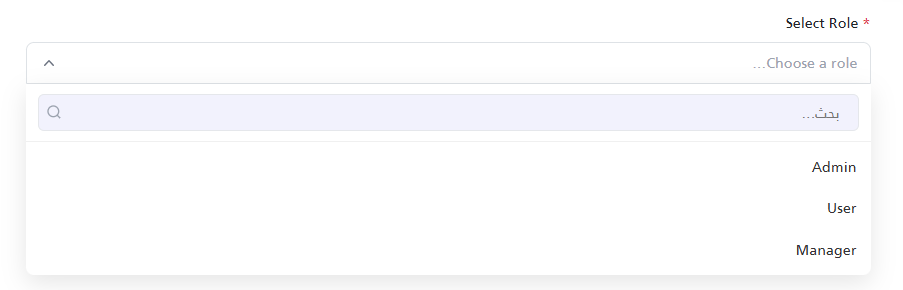
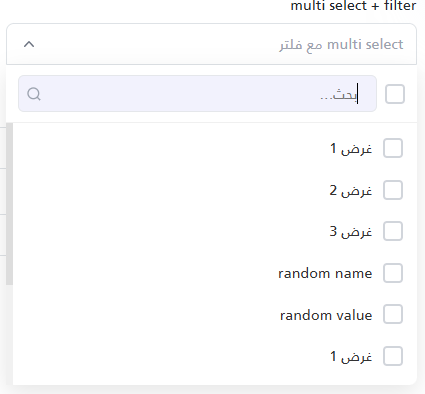

import Tabs from '@theme/Tabs';
import TabItem from '@theme/TabItem';

<Tabs>
<TabItem value="guide" label="Guide" default>
The `_SmartSelect.cshtml` partial view renders a custom dropdown on top of a hidden native `<select>`. It supports single and multiple selection, an optional search box, an optional clear button, a JavaScript API for changing options and values, and a change callback.

:::note
This component was previously named `MomahSelect` (`_MomahSelect.cshtml`, `UI/_MomahSelect`). It was renamed to `SmartSelect` without a compatibility alias; update existing views to `UI/_SmartSelect`.
:::

## UI Preview

| State         | Preview                         |
| ------------- | ------------------------------- |
| Single Select |            |
| Multi Select  |              |
| Single Filter | |
| Multi Filter  |   |

---

## Location

`Views/Shared/UI/_SmartSelect.cshtml`

## Properties

The component accepts an anonymous object (property names are case-insensitive) or a tuple.

### Configuration Properties

| Property | Type | Default Value | Description |
| :--- | :--- | :--- | :--- |
| `Id` | `string` | `""` | **Required.** Used as the native select's `id` and `name`, and to build the other element IDs. It is used in jQuery `#id` selectors, so it should not contain CSS special characters. |
| `Options` | `List<(string Value, string Text)>` | `null` | The options. In the anonymous-object form, a value of any other type (for example an array or `List<SelectListItem>`) is silently ignored and no options are rendered. |
| `Label` | `string` | `""` | The label text displayed above the input. If empty, the `<label>` element is omitted and the wrapper gets a `mt-3` top margin. |
| `Required`| `bool` | `false` | Displays a `*` next to the label, adds the `required` attribute to the native select, and enables validation. Converted with `Convert.ToBoolean`, so `"true"` also works. |
| `Placeholder`| `string` | `""` | Text shown when nothing is selected. In single mode it is also the text of the empty first option. |
| `Type` | `string` | `"single"` | `"multiple"` (case-insensitive) for multiple selection; any other value means single. |
| `Filter` | `string` | `null` | Shows a search box in the dropdown. Any non-empty string enables it, including `"false"`. |
| `Clear` | `string` | `null` | Shows a clear (`✕`) button when a value is selected. Any non-empty string enables it, including `"false"`. |
| `OnChange`| `string` | `null` | The name of a global JavaScript function to call when the user changes the selection. Receives `(value, id)`, where `value` is a string in single mode and an array of strings in multiple mode. |

*(Note: If passing a tuple instead of an anonymous object, use this exact order: `(Label, Required, Id, Placeholder, Options, Type, Filter, Clear, OnChange)`. At least the first five elements are required, `Required` must be a `bool`, and `Options` must be a `List<(string, string)>` or `null`; other types throw an exception.)*

The partial has no property for a pre-selected value. Use `setSelectValue` after the partial has rendered (see below).

---

## Usage Examples

### 1. Basic Single Select
A standard single-select dropdown without search or clearing.

```html
@await Html.PartialAsync("UI/_SmartSelect", new
{
    Id = "UserRole",
    Label = "Select Role",
    Required = true,
    Placeholder = "Choose a role...",
    Options = new List<(string, string)>
    {
        ("1", "Admin"),
        ("2", "User"),
        ("3", "Manager")
    }
})
```

### 2. Multi-Select with Clear Button
Use `Type = "multiple"` to show checkboxes, chips for the selected items (up to 3, then `...+N`), and a "select all" checkbox. Add `Filter` to also show a search box.

```html
@await Html.PartialAsync("UI/_SmartSelect", new
{
    Id = "AssignedServices",
    Label = "Assign Services",
    Required = false,
    Placeholder = "Select services",
    Type = "multiple",
    Clear = "true", // Allows clearing the entire selection
    Options = new List<(string, string)>
    {
        ("srv1", "Service 1"),
        ("srv2", "Service 2"),
        ("srv3", "Service 3")
    }
})
<!-- or, with search (selectFieldOptions must be a List<(string Value, string Text)>) -->

<partial name="UI/_SmartSelect"
	model='new { Label = "multi select + filter", Required = false, Id = "my-multi-select-2", Placeholder = "multi select مع فلتر", Options = selectFieldOptions, Type = "multiple", Filter = "filter", Clear = "clear" }' />

```

### 3. Single Select with Filter & OnChange Callback
Activating the search box for a single selection and reacting via a JavaScript callback.

```html
@await Html.PartialAsync("UI/_SmartSelect", new
{
    Id = "CitySelect",
    Label = "City",
    Placeholder = "Search city...",
    Filter = "true",
    OnChange = "onCityChanged",
    Options = new List<(string, string)>
    {
        ("c1", "Cairo"),
        ("c2", "Alexandria")
    }
})

<script>
    function onCityChanged(selectedValue, inputId) {
        console.log("The component " + inputId + " changed value to: " + selectedValue);
    }
</script>
```

---

## Behavior

- Clicking the trigger opens the dropdown and closes any other open instance. On first open, the dropdown element is moved to `<body>` and positioned under the trigger; it is repositioned on window resize and scroll.
- Search (when `Filter` is set) is a case-insensitive substring match on the option text. If nothing matches, `لا توجد نتائج` is shown.
- In multiple mode, "select all" toggles all options that are currently visible (after filtering).
- The selected value(s) are written to the hidden native `<select name="{Id}">`, which is what the form submits.
- `OnChange` is called when the user selects, deselects, clears, removes a chip, or uses "select all". It is **not** called by `setSelectValue` or `setSelectOption`.

---

## JavaScript API

The inline script runs as soon as the partial is rendered, so these functions are available immediately after it.

### Getting the Selected Value
```javascript
// Single: returns the value string, or null when nothing is selected
// Multiple: returns an array of strings ([] when nothing is selected)
var roleVal = window.getSelectedValue("UserRole");
```

### Setting the Selected Value
```javascript
// For single select (use the value of the option; an array uses its first element)
window.setSelectValue("UserRole", "2");

// For multi-select (must be an array of values)
window.setSelectValue("AssignedServices", ["srv1", "srv2"]);
```

Values that do not match an existing option are ignored (in single mode, a non-matching value clears the selection). Setting a value clears the validation error.

### Updating Options Dynamically (e.g., via AJAX)
```javascript
// Replaces the entire list of options and clears the current selection
var newOptions = [
    { value: "4", text: "Editor" },
    { value: "5", text: "Viewer" }
];
window.setSelectOption("UserRole", newOptions);
```

:::warning
`setSelectOption` inserts `value` and `text` into the dropdown's HTML **without escaping**. Escape any values that come from users or external APIs before passing them.
:::

Per-instance versions also exist: `window.setSelectOptions_{Id}(options)` and `window.setSelectValues_{Id}(value)`.

### Programmatic Validation
```javascript
// Manually triggers validation checks
// Returns true if valid, false if invalid. Displays error state UI automatically.
var isValid = window.validateSelect_UserRole();
```

---

## Validation

When `Required` is `true`:

- On form submission with no value, submission is prevented, the trigger gets a red border, the error message `{Label} مطلوب` is shown, and the dropdown opens if this is the first invalid field.
- The browser's native `invalid` event on the hidden select is intercepted, so the native validation bubble is not shown.
- Selecting a value clears the error.

---

## Dependencies

- jQuery, loaded before the partial (the inline script uses it immediately)
- Bootstrap 5 CSS (`form-label`, `text-danger`, `small`, `mt-1`, `mt-3`)
- The label also uses a `text-gray-700` class, which is not part of Bootstrap 5.

The partial outputs its `<style>` block every time it is rendered. The class names it styles (`.cs-*`, `.ss-*`, `.ms-*`, `.select-input-wrapper`) are global.

## Accessibility

- The custom trigger and options are `<div>` elements without ARIA roles, labels, or keyboard handling; the dropdown can only be operated with a mouse or touch.
- The visually hidden native `<select>` remains in the keyboard tab order. Changing it with the keyboard updates the submitted value but not the custom display.
- The `<label>` points to the hidden native select.

## RTL

The component is not direction-aware: the chevron, search icon, and chip spacing use fixed physical positions. Built-in texts are Arabic (`بحث...`, `مسح`, `تحديد الكل`, `لا توجد نتائج`).

## Security Notes

- Server-rendered labels, placeholders, and options use normal Razor encoding.
- In multiple mode, chip labels are read from the option text and inserted back into the page as HTML. Option text that contains HTML markup (even when it was encoded by Razor) is rendered as live HTML in the chip. Do not use untrusted option text with `Type = "multiple"`.
- Options added with `setSelectOption` are not escaped (see the warning above).

</TabItem>


<TabItem value="_SmartSelect.cshtml" label="_SmartSelect.cshtml">

```cshtml
@using System.Runtime.CompilerServices
@using Microsoft.AspNetCore.Routing
@model dynamic
@{
    string Label = "";
    bool Required = false;
    string Id = "";
    string Placeholder = "";
    List<(string Value, string Text)> Options = null;
    string Type = "single";
    string Filter = null;
    string Clear = null;
    string OnChange = null;

    if (Model is ITuple tuple)
    {
        Label             = tuple[0]?.ToString();
        Required          = (bool)tuple[1];
        Id                = tuple[2]?.ToString();
        Placeholder = tuple[3]?.ToString();
        Options           = (List<(string Value, string Text)>)tuple[4];
        Type              = tuple.Length > 5 ? tuple[5]?.ToString() : "single";
        Filter            = tuple.Length > 6 ? tuple[6]?.ToString() : null;
        Clear             = tuple.Length > 7 ? tuple[7]?.ToString() : null;
        OnChange          = tuple.Length > 8 ? tuple[8]?.ToString() : null;
    }
    else if (Model != null)
    {
        var props = new RouteValueDictionary(Model);
        if (props.TryGetValue("Label", out var label)) Label = label?.ToString();
        if (props.TryGetValue("Required", out var req)) Required = Convert.ToBoolean(req);
        if (props.TryGetValue("Id", out var id)) Id = id?.ToString();
        if (props.TryGetValue("Placeholder", out var defText)) Placeholder = defText?.ToString();
        if (props.TryGetValue("Options", out var opts)) Options = opts as List<(string Value, string Text)>;
        if (props.TryGetValue("Type", out var type)) Type = type?.ToString() ?? "single";
        if (props.TryGetValue("Filter", out var filter)) Filter = filter?.ToString();
        if (props.TryGetValue("Clear", out var clear)) Clear = clear?.ToString();
        if (props.TryGetValue("OnChange", out var onChange)) OnChange = onChange?.ToString();
    }

    if (string.IsNullOrEmpty(Type)) Type = "single";
    var isMultiple = Type.Equals("multiple", StringComparison.OrdinalIgnoreCase);
}

<style>
    /* ═══════════════ Shared Styles ═══════════════ */
    .cs-container { position: relative; width: 100%; }

    .cs-trigger {
        display: flex; align-items: center; width: 100%; min-height: 42px;
        padding: 5px 12px; border: 1px solid #dee2e6; border-radius: 8px;
        background: #fff; cursor: pointer; user-select: none;
        transition: border-color .2s, box-shadow .2s; gap: 6px;
    }
    .cs-trigger.cs-open { border-bottom-left-radius: 0; border-bottom-right-radius: 0; }

    .cs-chevron {
        width: 20px; height: 20px; margin-right: 4px; flex-shrink: 0;
        transition: transform .2s; fill: #6b7280;
    }
    .cs-open .cs-chevron { transform: rotate(180deg); }

    .cs-dropdown {
        display: none; position: absolute;
        background: #fff; border-top: none; border-radius: 0 0 8px 8px;
        box-shadow: 0 8px 24px rgba(0,0,0,.1); z-index: 99999;
        max-height: 320px; flex-direction: column;
    }
    .cs-dropdown.cs-visible { display: flex; }

    .cs-search-row {
        display: flex; align-items: center; gap: 8px;
        padding: 10px 12px; border-bottom: 1px solid #f0f0f0;
    }
    .cs-search-wrap { flex: 1; position: relative; display: flex; align-items: center; }
    .cs-search-input {
        width: 100%; border: 1px solid #e5e7eb; border-radius: 6px;
        padding: 7px 18px 7px 10px; font-size: .875rem; outline: none;
        transition: border-color .2s;
    }
    .cs-search-icon {
        position: absolute; left: 8px; top: 50%; transform: translateY(-50%);
        width: 16px; height: 16px; fill: none; stroke: #9ca3af;
        stroke-width: 2; pointer-events: none;
    }

    .cs-options { overflow-y: auto; flex: 1; padding: 4px 0; }
    .cs-no-results { padding: 14px; text-align: center; color: #9ca3af; font-size: .875rem; }

    /* ═══════════════ Single Select ═══════════════ */
    .ss-display-text {
        flex: 1; font-size: .9rem; color: #333;
        overflow: hidden; text-overflow: ellipsis; white-space: nowrap;
    }
    .ss-display-text.ss-placeholder { color: #9ca3af; }

    .ss-option {
        display: flex; align-items: center; gap: 10px; padding: 10px 14px;
        cursor: pointer; font-size: .9rem; color: #333; transition: background .1s;
    }
    .ss-option:hover         { background: #f5fffe; }
    .ss-option.ss-selected   { background: #eef9f9; color: #026B66; font-weight: 500; }
    .ss-option-text          { flex: 1; }

    /* ═══════════════ Multi Select ═══════════════ */
    .ms-chips {
        flex: 1; display: flex; flex-wrap: nowrap; align-items: center;
        gap: 5px; overflow: hidden; min-width: 0;
    }
    .ms-placeholder-text { color: #9ca3af; font-size: .9rem; white-space: nowrap; }

    .ms-chip {
        display: inline-flex; align-items: center; gap: 4px;
        background: #e8f5f4; border: 1px solid #b8dbd9; border-radius: 14px;
        padding: 2px 8px 2px 10px; font-size: .82rem; color: #026B66;
        white-space: nowrap; line-height: 1.4; max-width: 140px;
    }
    .ms-chip-text    { overflow: hidden; text-overflow: ellipsis; white-space: nowrap; }
    .ms-chip-remove  {
        cursor: pointer; color: #6b9f9d; font-size: .85rem; line-height: 1;
        font-weight: bold; transition: color .1s; display: flex; align-items: center;
    }
    .ms-chip-remove:hover { color: #dc3545; }
    .ms-chip-overflow { font-size: .8rem; color: #6b7280; white-space: nowrap; flex-shrink: 0; }

    .ms-select-all-check {
        width: 20px; height: 20px; border-radius: 4px; border: 2px solid #d1d5db;
        cursor: pointer; display: flex; align-items: center; justify-content: center;
        flex-shrink: 0; transition: all .15s; background: #fff;
    }
    .ms-select-all-check.ms-checked,
    .ms-select-all-check.ms-partial { background: #026B66; border-color: #026B66; }
    .ms-select-all-check .ms-icon-check,
    .ms-select-all-check .ms-icon-minus { display: none; }
    .ms-select-all-check.ms-checked .ms-icon-check { display: block; }
    .ms-select-all-check.ms-partial .ms-icon-minus { display: block; }

    .ms-option {
        display: flex; align-items: center; gap: 10px; padding: 10px 14px;
        cursor: pointer; font-size: .9rem; color: #333; transition: background .1s;
    }
    .ms-option:hover       { background: #f5fffe; }
    .ms-option.ms-selected { background: #eef9f9; }

    .ms-option-check {
        width: 20px; height: 20px; border-radius: 4px; border: 2px solid #d1d5db;
        flex-shrink: 0; display: flex; align-items: center; justify-content: center;
        transition: all .15s; background: #fff;
    }
    .ms-option.ms-selected .ms-option-check { background: #026B66; border-color: #026B66; }
    .ms-option-check svg                    { display: none; }
    .ms-option.ms-selected .ms-option-check svg { display: block; }
    .ms-option-text { flex: 1; }

    /* ═══════════════ Clear Button ═══════════════ */
    .cs-clear {
        display: none; align-items: center; justify-content: center;
        width: 20px; height: 20px; flex-shrink: 0;
        cursor: pointer;font-size: .8rem; color: #888; font-weight: bold;
    }
    .cs-trigger.cs-has-value .cs-clear { display: flex; }

    /* ═══════════════ Validation ═══════════════ */
    .select-input-wrapper.is-invalid .cs-trigger {
        border-color: #dc3545 !important;
        box-shadow: 0 0 0 3px rgba(220,53,69,.15) !important;
    }

    /* Hidden native select */
    .cs-native-select {
        position: absolute; opacity: 0; width: 1px; height: 1px;
        z-index: -1; border: 0; padding: 0; margin: -1px;
        overflow: hidden; clip: rect(0,0,0,0); pointer-events: none;
    }
</style>

<div class="@(string.IsNullOrEmpty(Label) ? "mt-3" : "")">
    @if (!string.IsNullOrEmpty(Label))
    {
        <label class="form-label text-gray-700" for="@Id">
            @if (Required) { <span class="text-danger">*</span> }
            @Label
        </label>
    }

    <div class="select-input-wrapper" id="@Id-wrapper" data-placeholder="@Placeholder">

        <!-- Hidden native select for form submission -->
        <select name="@Id" id="@Id" class="cs-native-select"
                @(isMultiple ? "multiple=\"multiple\"" : "")
                @(Required ? "required" : "")>
            @if (!isMultiple)
            {
                <option value="">@Placeholder</option>
            }
            @if (Options != null)
            {
                foreach (var option in Options)
                {
                    <option value="@option.Value">@option.Text</option>
                }
            }
        </select>

        <!-- Custom select UI -->
        <div class="cs-container" id="@Id-cs">
            <div class="cs-trigger" id="@Id-trigger">
                @if (isMultiple)
                {
                    <div class="ms-chips" id="@Id-chips">
                        <span class="ms-placeholder-text">@Placeholder</span>
                    </div>
                }
                else
                {
                    <span class="ss-display-text ss-placeholder" id="@Id-display">@Placeholder</span>
                }
                @if (!string.IsNullOrEmpty(Clear))
                {
                    <span class="cs-clear" id="@Id-clear" title="مسح">&#10005;</span>
                }
                <svg class="cs-chevron" viewBox="0 0 20 20">
                    <path fill-rule="evenodd"
                          d="M5.23 7.21a.75.75 0 011.06.02L10 11.168l3.71-3.938a.75.75 0 111.08 1.04l-4.25 4.5a.75.75 0 01-1.08 0l-4.25-4.5a.75.75 0 01.02-1.06z" />
                </svg>
            </div>

            <div class="cs-dropdown" id="@Id-dropdown">
                @if (isMultiple || !string.IsNullOrEmpty(Filter))
                {
                    <div class="cs-search-row">
                        @if (isMultiple)
                        {
                            <div class="ms-select-all-check" id="@Id-selectall" title="تحديد الكل">
                                <svg class="ms-icon-check" width="14" height="14" viewBox="0 0 14 14" fill="none">
                                    <path d="M11.6666 3.5L5.24998 9.91667L2.33331 7" stroke="white" stroke-width="2"
                                          stroke-linecap="round" stroke-linejoin="round" />
                                </svg>
                                <svg class="ms-icon-minus" width="14" height="14" viewBox="0 0 14 14" fill="none">
                                    <path d="M3 7H11" stroke="white" stroke-width="2" stroke-linecap="round" />
                                </svg>
                            </div>
                        }
                        @if (!string.IsNullOrEmpty(Filter))
                        {
                            <div class="cs-search-wrap">
                                <input type="text" class="cs-search-input" id="@Id-search"
                                       placeholder="بحث..." autocomplete="off" />
                                <svg class="cs-search-icon" viewBox="0 0 24 24">
                                    <circle cx="11" cy="11" r="8" />
                                    <line x1="21" y1="21" x2="16.65" y2="16.65" />
                                </svg>
                            </div>
                        }
                    </div>
                }

                <div class="cs-options" id="@Id-options">
                    @if (Options != null && Options.Count > 0)
                    {
                        foreach (var option in Options)
                        {
                            if (isMultiple)
                            {
                                <div class="ms-option" data-value="@option.Value">
                                    <div class="ms-option-check">
                                        <svg width="14" height="14" viewBox="0 0 14 14" fill="none">
                                            <path d="M11.6666 3.5L5.24998 9.91667L2.33331 7"
                                                  stroke="white" stroke-width="2"
                                                  stroke-linecap="round" stroke-linejoin="round" />
                                        </svg>
                                    </div>
                                    <span class="ms-option-text">@option.Text</span>
                                </div>
                            }
                            else
                            {
                                <div class="ss-option" data-value="@option.Value">
                                    <span class="ss-option-text">@option.Text</span>
                                </div>
                            }
                        }
                    }
                    else
                    {
                        <div class="cs-no-results">لا توجد نتائج</div>
                    }
                </div>
            </div>
        </div>
    </div>

    @if (Required)
    {
        <div class="text-danger small mt-1" id="@Id-error" style="display: none;">@Label مطلوب</div>
    }
</div>

<script>
(function () {
    var id         = '@Id';
    var isMultiple = @(isMultiple ? "true" : "false");
    var placeholder = $('#' + id + '-wrapper').attr('data-placeholder');

    var $el               = $('#' + id);
    var $wrapper          = $('#' + id + '-wrapper');
    var $errorDiv         = $('#' + id + '-error');
    var $trigger          = $('#' + id + '-trigger');
    var $dropdown         = $('#' + id + '-dropdown');
    var $search           = $('#' + id + '-search');
    var $optionsContainer = $('#' + id + '-options');
    var $clearBtn         = $('#' + id + '-clear');

    // ── SVG snippets ──────────────────────────────────────────────────────────
    var CHECK_SVG = '<svg width="14" height="14" viewBox="0 0 14 14" fill="none">' +
                   '<path d="M11.6666 3.5L5.24998 9.91667L2.33331 7" stroke="white" ' +
                   'stroke-width="2" stroke-linecap="round" stroke-linejoin="round"/></svg>';

    // ── HTML builders (single source of truth) ────────────────────────────────
    function buildSingleOptionHtml(opt) {
        return '<div class="ss-option" data-value="' + opt.value + '">' +
               '<span class="ss-option-text">' + opt.text + '</span></div>';
    }
    function buildMultiOptionHtml(opt) {
        return '<div class="ms-option" data-value="' + opt.value + '">' +
               '<div class="ms-option-check">' + CHECK_SVG + '</div>' +
               '<span class="ms-option-text">' + opt.text + '</span></div>';
    }
    var buildOptionHtml = isMultiple ? buildMultiOptionHtml : buildSingleOptionHtml;

    // ── Validation ────────────────────────────────────────────────────────────
    function clearValidation() {
        $wrapper.removeClass('is-invalid').addClass('is-valid');
        $errorDiv.hide();
    }
    function validateSelect() {
        var isReq = $el.attr('required') !== undefined;
        var val   = $el.val();
        var empty = !val || (Array.isArray(val) && val.length === 0) || val === '';
        if (isReq && empty) {
            $wrapper.addClass('is-invalid').removeClass('is-valid');
            $errorDiv.show();
            return false;
        }
        clearValidation();
        return true;
    }
    function revalidateIfNeeded() {
        if ($wrapper.hasClass('is-invalid') || $wrapper.hasClass('is-valid')) {
            validateSelect();
        } else {
            clearValidation();
        }
    }

    // ── Callback ──────────────────────────────────────────────────────────────
    function triggerCallback() {
        var fn = '@OnChange';
        if (fn && typeof window[fn] === 'function') window[fn]($el.val(), id);
    }

    // ── Dropdown toggle ───────────────────────────────────────────────────────
    $trigger.on('click', function (e) {
        if ($(e.target).closest('.ms-chip-remove').length) return;
        e.stopPropagation();
        var isOpen = $dropdown.hasClass('cs-visible');
        closeAllDropdowns();
        if (!isOpen) {
            $('body').append($dropdown);
            var offset = $trigger.offset();
            $dropdown.css({
                top: offset.top + $trigger.outerHeight(),
                left: offset.left,
                width: $trigger.outerWidth()
            });

            $dropdown.addClass('cs-visible');
            $trigger.addClass('cs-open');
            $search.val('').trigger('input');
            setTimeout(function () { $search.focus(); }, 50);
        }
    });
    $(document).on('click.cs_' + id, function (e) {
        if (!$(e.target).closest('#' + id + '-cs').length && !$(e.target).closest('#' + id + '-dropdown').length) {
            $dropdown.removeClass('cs-visible');
            $trigger.removeClass('cs-open');
        }
    });
    function closeAllDropdowns() {
        $('.cs-dropdown').removeClass('cs-visible');
        $('.cs-trigger').removeClass('cs-open');
    }

    // Reposition on window resize
    $(window).on('resize.cs_' + id + ' scroll.cs_' + id, function() {
        if ($dropdown.hasClass('cs-visible')) {
            var offset = $trigger.offset();
            $dropdown.css({
                top: offset.top + $trigger.outerHeight(),
                left: offset.left,
                width: $trigger.outerWidth()
            });
        }
    });

    // ── Search ────────────────────────────────────────────────────────────────
    $search.on('input', function () {
        var term         = $(this).val().toLowerCase();
        var optSelector  = isMultiple ? '.ms-option'      : '.ss-option';
        var textSelector = isMultiple ? '.ms-option-text' : '.ss-option-text';
        var hasResults   = false;
        $optionsContainer.find(optSelector).each(function () {
            var match = !term || $(this).find(textSelector).text().toLowerCase().indexOf(term) > -1;
            $(this).toggle(match);
            if (match) hasResults = true;
        });
        $optionsContainer.find('.cs-no-results').remove();
        if (!hasResults) $optionsContainer.append('<div class="cs-no-results">لا توجد نتائج</div>');
        if (isMultiple) updateSelectAllState();
    });

    // ═══════════════════════════════════════════════════════════════════════════
    // MODE: SINGLE SELECT
    // ═══════════════════════════════════════════════════════════════════════════
    if (!isMultiple) {
        var $display      = $('#' + id + '-display');
        var selectedValue = '';

        function setSingleHasValue(has) {
            $trigger.toggleClass('cs-has-value', has);
        }

        $optionsContainer.on('click', '.ss-option', function () {
            var val  = $(this).data('value').toString();
            var text = $(this).find('.ss-option-text').text();
            $optionsContainer.find('.ss-option').removeClass('ss-selected');
            selectedValue = val;
            $(this).addClass('ss-selected');
            $el.val(val);
            $display.text(text).removeClass('ss-placeholder');
            setSingleHasValue(true);
            $dropdown.removeClass('cs-visible');
            $trigger.removeClass('cs-open');
            clearValidation();
            triggerCallback();
        });

        // Clear button
        $clearBtn.on('click', function (e) {
            e.stopPropagation();
            resetSingle();
            setSingleHasValue(false);
            revalidateIfNeeded();
            triggerCallback();
        });

        // Internal reset helper
        function resetSingle() {
            selectedValue = '';
            $el.val('');
            $display.text(placeholder).addClass('ss-placeholder');
            $optionsContainer.find('.ss-option').removeClass('ss-selected');
        }

        // Select a value programmatically
        function applySingleValue(v) {
            var $opt = $optionsContainer.find('.ss-option[data-value="' + v + '"]');
            $optionsContainer.find('.ss-option').removeClass('ss-selected');
            if ($opt.length) {
                var text  = $opt.find('.ss-option-text').text();
                selectedValue = v.toString();
                $opt.addClass('ss-selected');
                $el.val(v);
                $display.text(text).removeClass('ss-placeholder');
                setSingleHasValue(true);
            } else {
                resetSingle();
                setSingleHasValue(false);
            }
        }

        // Public: replace options list
        window['setSelectOptions_' + id] = function (newOptions) {
            $el.empty().append($('<option>').val('').text(placeholder));
            $optionsContainer.empty();
            resetSingle();
            if (newOptions && newOptions.length > 0) {
                newOptions.forEach(function (opt) {
                    $el.append($('<option>').val(opt.value).text(opt.text));
                    $optionsContainer.append(buildOptionHtml(opt));
                });
            } else {
                $optionsContainer.append('<div class="cs-no-results">لا توجد نتائج</div>');
            }
            revalidateIfNeeded();
        };

        // Public: set selected value – accepts a single value OR an array (first element used)
        window['setSelectValues_' + id] = function (value) {
            var v = Array.isArray(value) ? (value.length > 0 ? value[0] : '') : (value != null ? value : '');
            applySingleValue(v.toString());
            clearValidation();
        };

    // ═══════════════════════════════════════════════════════════════════════════
    // MODE: MULTI SELECT
    // ═══════════════════════════════════════════════════════════════════════════
    } else {
        var $chipsContainer  = $('#' + id + '-chips');
        var $selectAll       = $('#' + id + '-selectall');
        var selectedValues   = [];
        var MAX_VISIBLE_CHIPS = 3;

        function syncToNative()  { $el.val(selectedValues); }

        function updateChips() {
            $chipsContainer.empty();
            if (selectedValues.length === 0) {
                $chipsContainer.append($('<span>').addClass('ms-placeholder-text').text(placeholder));
                return;
            }
            selectedValues.slice(0, MAX_VISIBLE_CHIPS).forEach(function (v) {
                var $opt = $optionsContainer.find('.ms-option[data-value="' + v + '"]');
                var text = $opt.length ? $opt.find('.ms-option-text').text() : v;
                $chipsContainer.append(
                    '<span class="ms-chip">' +
                    '<span class="ms-chip-text">'   + text + '</span>' +
                    '<span class="ms-chip-remove" data-val="' + v + '">&#10005;</span>' +
                    '</span>'
                );
            });
            var overflow = selectedValues.length - MAX_VISIBLE_CHIPS;
            if (overflow > 0) $chipsContainer.append('<span class="ms-chip-overflow">...+' + overflow + '</span>');
        }

        function updateSelectAllState() {
            var visibleOptions    = $optionsContainer.find('.ms-option:visible');
            var allVisibleValues  = visibleOptions.map(function () { return $(this).data('value').toString(); }).get();
            var cnt = allVisibleValues.filter(function (v) { return selectedValues.indexOf(v) > -1; }).length;
            $selectAll.removeClass('ms-checked ms-partial');
            if (visibleOptions.length === 0) return;
            if (cnt === allVisibleValues.length) $selectAll.addClass('ms-checked');
            else if (cnt > 0)                   $selectAll.addClass('ms-partial');
        }

        function afterChange() {
            syncToNative();
            updateChips();
            updateSelectAllState();
            $trigger.toggleClass('cs-has-value', selectedValues.length > 0);
            clearValidation();
            triggerCallback();
        }

        // Clear button (multi)
        $clearBtn.on('click', function (e) {
            e.stopPropagation();
            selectedValues = [];
            $optionsContainer.find('.ms-option').removeClass('ms-selected');
            afterChange();
            revalidateIfNeeded();
        });

        // Option click
        $optionsContainer.on('click', '.ms-option', function () {
            var val = $(this).data('value').toString();
            var idx = selectedValues.indexOf(val);
            if (idx > -1) { selectedValues.splice(idx, 1); $(this).removeClass('ms-selected'); }
            else          { selectedValues.push(val);      $(this).addClass('ms-selected');    }
            afterChange();
        });

        // Select-all click
        $selectAll.on('click', function () {
            var visibleOptions   = $optionsContainer.find('.ms-option:visible');
            var allVisibleValues = visibleOptions.map(function () { return $(this).data('value').toString(); }).get();
            var allSelected      = allVisibleValues.every(function (v) { return selectedValues.indexOf(v) > -1; });
            if (allSelected) {
                allVisibleValues.forEach(function (v) {
                    var idx = selectedValues.indexOf(v);
                    if (idx > -1) selectedValues.splice(idx, 1);
                });
                visibleOptions.removeClass('ms-selected');
            } else {
                allVisibleValues.forEach(function (v) {
                    if (selectedValues.indexOf(v) === -1) selectedValues.push(v);
                });
                visibleOptions.addClass('ms-selected');
            }
            afterChange();
        });

        // Chip remove
        $chipsContainer.on('click', '.ms-chip-remove', function (e) {
            e.stopPropagation();
            var val = $(this).data('val').toString();
            var idx = selectedValues.indexOf(val);
            if (idx > -1) {
                selectedValues.splice(idx, 1);
                $optionsContainer.find('.ms-option[data-value="' + val + '"]').removeClass('ms-selected');
            }
            afterChange();
        });

        // Public: replace options list
        window['setSelectOptions_' + id] = function (newOptions) {
            $el.empty();
            $optionsContainer.empty();
            selectedValues = [];
            updateChips();
            updateSelectAllState();
            syncToNative();
            if (newOptions && newOptions.length > 0) {
                newOptions.forEach(function (opt) {
                    $el.append($('<option>').val(opt.value).text(opt.text));
                    $optionsContainer.append(buildOptionHtml(opt));
                });
            } else {
                $optionsContainer.append('<div class="cs-no-results">لا توجد نتائج</div>');
            }
            revalidateIfNeeded();
        };

        // Public: set selected values – accepts an array of values
        window['setSelectValues_' + id] = function (valuesArr) {
            selectedValues = [];
            $optionsContainer.find('.ms-option').removeClass('ms-selected');
            if (valuesArr && valuesArr.length > 0) {
                valuesArr.forEach(function (v) {
                    var $opt = $optionsContainer.find('.ms-option[data-value="' + v + '"]');
                    if ($opt.length) {
                        selectedValues.push(v.toString());
                        $opt.addClass('ms-selected');
                    }
                });
            }
            syncToNative();
            updateChips();
            updateSelectAllState();
            $trigger.toggleClass('cs-has-value', selectedValues.length > 0);
            clearValidation();
        };
    }

    // ── Global helpers (registered once per page via guard) ───────────────────
    if (!window.getSelectedValue) {
        window.getSelectedValue = function (inputId) {
            var $input = $('#' + inputId);
            if (!$input.length) { console.warn("Select '" + inputId + "' not found"); return null; }
            if ($input.prop('multiple')) { var v = $input.val(); return v ? v : []; }
            var v = $input.val();
            return (v === '' || v == null) ? null : v;
        };
    }

    // Convenience wrappers that accept the id as the first argument
    window.setSelectOption = function (inputId, newOptions) {
        var fn = window['setSelectOptions_' + inputId];
        if (fn) fn(newOptions);
        else console.warn("setSelectOption: select '" + inputId + "' not found");
    };
    window.setSelectValue = function (inputId, value) {
        var fn = window['setSelectValues_' + inputId];
        if (fn) fn(value);
        else console.warn("setSelectValue: select '" + inputId + "' not found");
    };

    // ── Validation hooks ──────────────────────────────────────────────────────
    $el.on('invalid', function (e) {
        e.preventDefault();
        if (!validateSelect()) {
            var form = this.form;
            var firstInvalid = form ? form.querySelector(':invalid') : null;
            if (!form || firstInvalid === this) {
                if (!$dropdown.hasClass('cs-visible')) $trigger.trigger('click');
            }
        }
    });

    $(document).on('submit', 'form', function (e) {
        if ($(this).find('#' + id).length > 0 && !validateSelect()) {
            e.preventDefault();
            var firstInvalid = $(this).find('.is-invalid').first();
            if (firstInvalid.length === 0 || firstInvalid[0] === $wrapper[0]) {
                if (!$dropdown.hasClass('cs-visible')) $trigger.trigger('click');
            }
        }
    });

    window['validateSelect_' + id] = validateSelect;
})();
</script>
```

</TabItem>
</Tabs>
