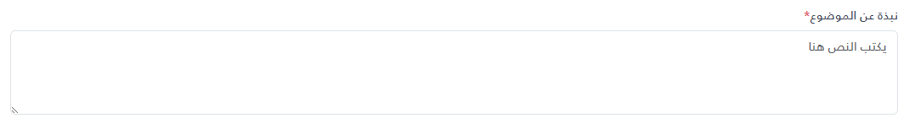

import Tabs from '@theme/Tabs';
import TabItem from '@theme/TabItem';

<Tabs>
<TabItem value="guide" label="Guide" default>
The `_TextArea.cshtml` partial view renders a labelled Bootstrap `<textarea>` with a fixed height. It takes a tuple model and an optional initial value through `ViewData`. The full source is in the `_TextArea.cshtml` tab.

## UI Preview

| State   | Preview                 |
| ------- | ----------------------- |
| Default |  |

---

## Location

`Views/Shared/UI/_TextArea.cshtml`

### How to use
```cshtml
<partial name="UI/_TextArea" model='("عنصر مطلوب بقيمة توضيحيه", true, "my-custom-id-1", "عنصر مطلوب بقيمة توضيحيه")' />
<partial name="UI/_TextArea" model='("عنصر غير مطلوب بقيمة توضيحيه افتراضية", false, "my-custom-id-2", "")'
	view-data='new ViewDataDictionary(ViewData) { { "Value", "القيمة الافتراضية" } }' />

@await Html.PartialAsync("UI/_TextArea",
		(Label: "Notes", Required: false, Id: "notes", Placeholder: ""),
		new ViewDataDictionary(ViewData) { { "Value", "this is test text" } })
```

## Parameters

The model type is the tuple `(string Label, bool Required, string Id, string Placeholder)`. All four elements must be passed, in this order.

| Parameter | Type | Description |
| --- | --- | --- |
| Label | `string` | The label text. |
| Required | `bool` | Adds a red asterisk and the native `required` attribute. |
| Id | `string` | The textarea's `id` (and the label's `for`). |
| Placeholder | `string` | Placeholder text. `null` or empty uses the default `"يكتب النص هنا"`. |

### Initial Value

The textarea's content is read from `ViewData["Value"]` (as a string). Because partial views receive a copy of the parent view's `ViewData`, a `"Value"` entry set in the parent view also applies to every `_TextArea` rendered without its own `view-data`.

## Known Limitations

- **The textarea has no `name` attribute**, so its value is not included when the form is submitted. Read it with JavaScript (for example `document.getElementById(id).value`) if you need it.
- When no `ViewData["Value"]` is provided, the textarea starts with a single space. As a result the placeholder is not visible, and the native `required` check passes even if the user types nothing.
- The height is fixed at `100px` (`rows="3"`); there is no auto-resize or character counter.

## Behavior

- No JavaScript is included. Required validation is the browser's native `required` validation (see the limitation above).
- All values are output with normal Razor encoding.
- The label is associated with the textarea (`for="{Id}"`). No ARIA attributes are added.

## Dependencies

- Bootstrap 5 CSS (`form-label`, `form-control`, `text-danger`, `mb-4`)
- The label also uses a `text-gray-700` class, which is not part of Bootstrap 5.

</TabItem>


<TabItem value="_TextArea.cshtml" label="_TextArea.cshtml">

```cshtml
@model (string Label, bool Required, string Id, string Placeholder)
@{
    var placeholder = string.IsNullOrEmpty(Model.Placeholder) ? "يكتب النص هنا" : Model.Placeholder;
    var value = ViewData["Value"] as string ?? " ";
}
<div class="mb-4">
	<label class="form-label text-gray-700" for="@Model.Id">
		@if (Model.Required)
		{
		<span class="text-danger">*</span>
		}
		@Model.Label
	</label>
	<textarea id="@Model.Id" class="form-control" style="height: 100px;" rows="3" placeholder="@placeholder"
		@(Model.Required ? "required" : "" )>@value</textarea>
</div>

```

</TabItem>
</Tabs>
